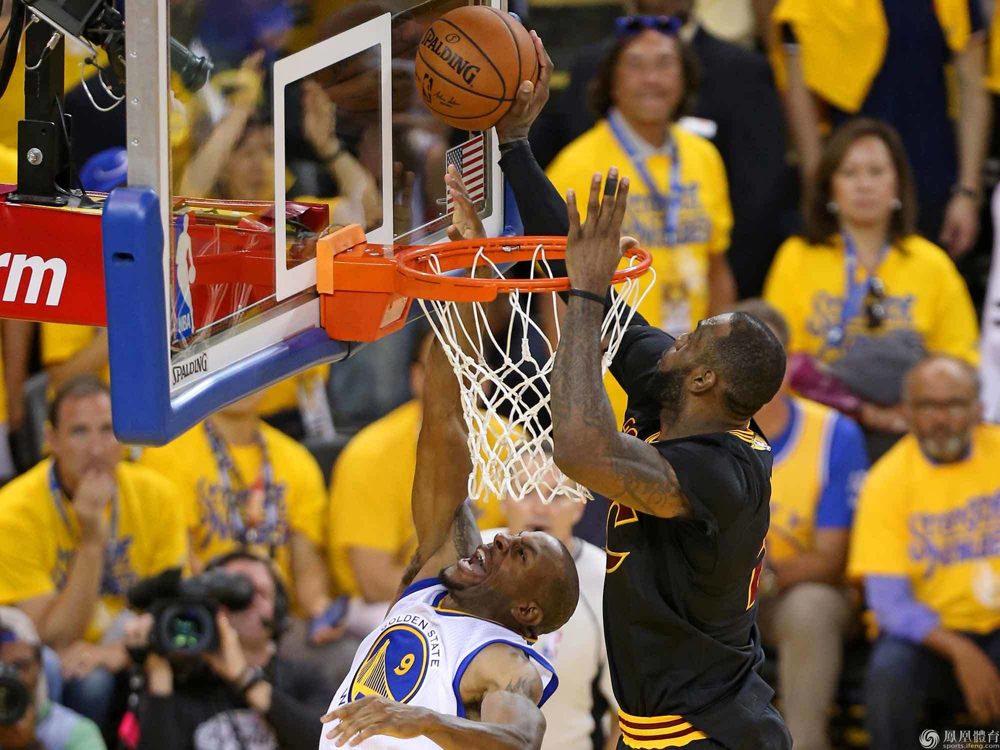
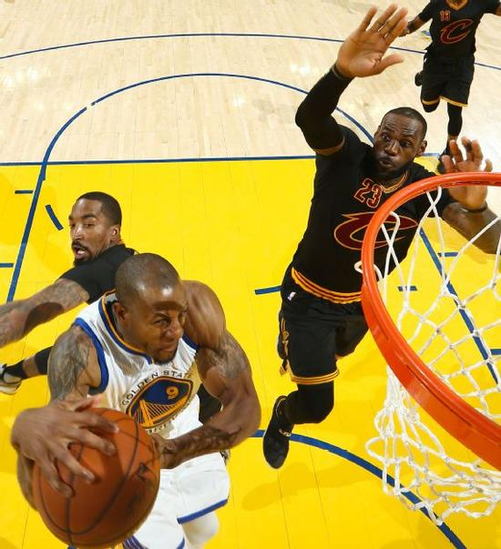
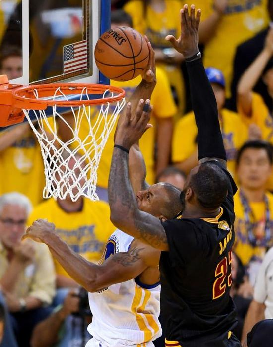
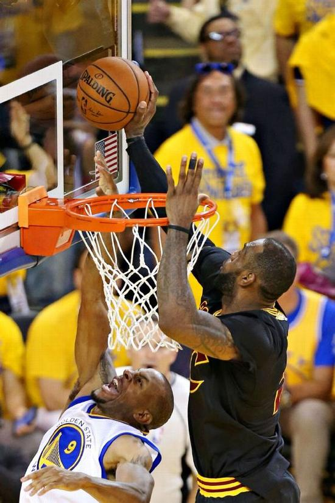

# THE BLOCK 
[2016-06-20](#data.create_time) 
  
 2016年NBA总决赛抢七战的四节异常胶着，平衡始终没被打破，随着克雷-汤普森在第四节还剩4：39秒时的上篮命中，两队战至89平。在之后的几分钟内，场上比分混杂着双方的神经紧绷、极度疲劳以及依旧存在的防守热情，凝固在球场上。  
 勒布朗-詹姆斯跳投不中；史蒂芬-库里远距离三分不中。詹姆斯又一次跳投不中；汤普森投篮不中。詹姆斯在禁区内遭到伊戈达拉封盖；伊戈达拉错失三分机会。凯文-勒夫跳勾不中；德雷蒙德-格林三分球刷匡而出。凯里-欧文近距离跳投不中。 
 就像是两个职业拳击手在一场比赛的末尾对着空气出拳，两队合计的9中0完全是在折磨人的神经，他们都想在这段时间内将对手一下击倒，但眼前却是一番不断打铁的场面，时间也在慢慢减少。 
 在欧文投篮不中之后，勇士看起来率先找到了骑士防守的漏洞。伊戈达拉抓下防守篮板，开始持球推进，这时计时器显示还剩1分54秒。库里沿左侧一路加速，占据了领跑位置。当伊戈达拉穿过半场的时候，他看到了左侧的库里，一记准确的胸前传球，接着又直奔篮下而去。库里接球又迅速回传，一个击地给到身前的伊戈达拉，保证后者可以毫不费力地接球完成终结。 
 如果这时候暂停视频，你会发现伊戈达拉身处罚球线右侧，J.R。-史密斯则在罚球线左侧，差不多有两英尺之远??即使他的身体是面对库里的??而后来的主角詹姆斯还人在左侧45度的三分线外。 
 之后两秒内发生的一切改变了整个比赛。伊戈达拉运了两步准备起跳完成上篮，看起来没人能阻止他，但詹姆斯打量了一下，从身后全力冲向一哥，一巴掌帽掉了看似必进的一个上篮，这时候比赛还剩1分50秒。 
 如果没有詹姆斯这个追帽，勇士就取得领先了??伴随着主场球迷刺耳的喊声??胜利的天平也会倾向金州。但不幸的是，这个盖帽从而引发了凯里-欧文那个必将载入史册的三分，仅仅半分钟时间，总冠军经历了一段神奇的旅程，克里夫兰人生生将其从奥克兰人的手中抢走。 

   
    
   