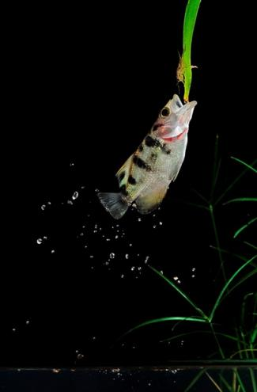

# 穷人为什么穷
Every sound of the bell in daily . Have you been awaken ?   
> 每日敲钟合适觉醒  

Take a closer look at this planet..in on ever changing world.  
> 看清楚这奇妙的地球,不段演变的世界.  

Determined by mankind.
> 掌握在人类手中.  

Your destiny are determined by the choice you make.  
> 你的命运,也掌握在你的手中.  

Where are you heading? what are you choice?  
> 命运的舵手航向何方?  

Have you live life to the fullest?  
> 你获得精彩吗?  

In reality,Time wait for no one.  
> 现实社会,分秒必争.  

In this competitive society.  
> 你争我夺，争先恐后.  

Only the stronger survive，the weak will be eliminated.  
> 弱汰强留，弱肉强食.  

You will regret once moved wrong step.
> 一失足成千古恨.  

That sacrifice by meaningless.
> 白白牺牲.  

Struggle for power but get nothing.
> 争权夺利 一无所有.  

To be undermined by others. 
> 不知天高地厚的下场.  

All the effort just destroy in a second. 
> 努力的成果 毁于一旦.  

And time wasted for nothing.  
> 不自量力白忙一场.  

Leader…with a clear focus.  
> 强者有锐利的眼光.  

And with set goals ,will achieve success.  
> 目标明确 一击即中.  

Heroes… people who are willing to try.  
Willing to make sacrifice.  
To overcome obstacles.  
> 勇者敢于尝试不怕牺牲克服障碍.  

And face all challengers.  
> 接受挑战.  

Will emerge victorious.  
> 将取得胜利.  

The past…is already history.  
> 过去已经成为历史.  

success!You have to grab the opportunity to change your destiny  
> 你必须掌握机会 改变命运  

Life… Like a never ending Journey  
> 人生就像不停的快车  

Where time waits for no one  
> 岁月不留痕  

Life is like a stage  
> 人生就像舞台  

Are you toiling your life away?  
> 你是否劳劳碌碌 营营役役?  

You by when to release yourself. towards freedom?  
> 你何时摆脱生活的枷锁，迈向自由  

Do you ever picture yourself when you’re old?  
> 你可曾想过晚年的情景   

Would you be worrying for your future generation?  
> 担心你的下一代吗？  

Do you feel like a zombie?  
> 你是否觉得自己像个行尸走肉？  

Aimlessly in your life  
> 兜兜转转 人生几十年  

Would you be willing?   
> 你是否甘心  

To work throughout your entire life;  
> 营营役役忙碌一生何时终结  

Till you…  
Worry Panic Helpless  
> 焦虑 恐慌 无助  

Explore life without boundaries  
> 生存无边界  

To look beyond  
> 突破困境  

