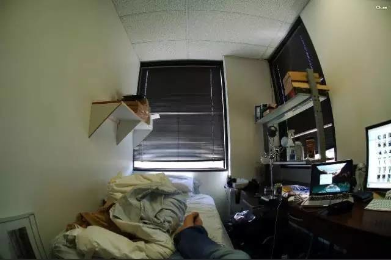

# 如何成为1%的富豪
[2015-07-03](#data.create_time)  

到今天为止，我做到了三次。但这件事没有捷径，除非你能中彩票，否则我也给不了你挣钱的速成方法。  
我在80年代中期随父母离开中国大陆来到美国，那时根本没人在意中国。就算是在西雅图这里的华人群体中，我们也被看做是第三等公民，排在ABC甚至是台湾人后面。我们家没有任何技术背景、财产或是人脉，我们唯一能做的就是体力活。我的父母在国内原本是大学教授，而且不会说英语，也不会经商，所以别以为我在做生意这方面有先天优势。他们在这个资本主义的世界里一点用处也没有，甚至对钱都没什么概念。他们在美国只能做保姆和清洁工，在50多岁的时候从头开始。所以，要是有DIAO丝抱怨说顶尖1%的土豪们有什么不公平的优势，我想对你们说，去你妈的。我唯一的优势就是我手脚完好，而且生性顽强好斗。 
我的第一份工作是在西雅图本地的Safeway超市里，连麦当劳都没要我，因为我的英语实在太烂了。那年我16岁。我像疯了一样地工作，总是盼望着周末、假期、还有任何我可以加班的时间，因为加班工资更高。我骑车冒雨上班（西雅图的雨天多得一逼），有时候下雪路上结冰，有时候下晚班要到凌晨2点才能回家，然而回家了我作业还没做。我两年就上完了四年的高中，这样我才能和我的同龄人一起毕业（我的高中不认可中国高中的课程）。我不想在20岁的时候还在高中里上学，所以我上的课也比正常人多。这段时间我同时打三份工，晚上在7-11超市上班，白天去呼叫中心接电话被人调戏，有时候还去大学当实验对象，在市里的血库卖血-只要来钱，我什么都干。所以评论里有人抱怨自己要加班加点才能交得起房租，我完全理解你们的处境。但我不会对你有任何同情，因为这段时间里我每天都对自己说，这只是暂时的，只要我努力，我一定会离开这糟糕的处境。 
在Safeway超市做了两年收银员后，我从家里搬出来了，因为我遇见了我第一个女朋友，但是父母不同意。我那年18岁。我的支出更大了，而且还得为大学存钱，所以我开始找收入更高的工作，而我只是个高中生。结果我发现，只有做销售的收入比$5.25（最低工资）要高。 
像很多男生一样，我喜欢各种各样的机器，而且我最喜欢相机。在国内的时候，我们家很穷，所以根本不可能接触到相机-这是一个很昂贵的爱好。我在西雅图会在Bellevue的相机店呆上半天，就为了把玩这些牛逼的机器。让我惊讶的是，很多销售员工对相机的了解还不如我多。我意识到我可能会比他们做得更好。所以我问店里的经理能不能给我一份销售的工作。那时我的英语还是不太好，而且从来没有销售的经验-经典的先有鸡还是先有蛋的问题。我知道必须找一点销售的经验。 
我看到一个Cutco刀具的广告，说一个小时可以挣$9。说白了就是挨家挨户地推销。我买了一套基本款刀具，开始销售。我找到一份在波音公司西雅图办公室的中国工程师名单，然后开始挨个联系他们。我编了一堆故事，比如介绍刀具是学校市场课的作业，而且装作他们都认识我在波音工作的叔叔。大多数人觉得一个高中生不会是什么坏人，还有一些甚至模糊地记得我叔叔的名字，所以很少有人会挂我的电话。这教会了我一个道理：如果你不去索取，你就不会获得。我甚至还叫我叔叔开车送我去这些“朋友”家做刀具演示。当然了，不是每个人都会买，但是那些买了刀的人直到今天还在和我提起那些刀具质量多好。 
有了一个暑假的销售经验，我把它加到了我的简历上，然后拿到了一份在本地相机店销售相机的工作。但是连这份工作也来之不易，为了拿到offer，我不得不无薪工作一个月，而且我告诉经理，要是这个月底我没有完成销售任务，我就不干了。在Cameras West（现在倒闭了）、Silos（也倒闭了）和Video Only这些本地的相机店我都干过，不管在哪家，我几乎都是销售冠军，因为我把所有的空余时间都花在了解我销售的产品上面。在不上班的时候，我会去其他电子产品商店了解他们销售的产品；我会跟在别的销售身边，听他们是怎么销售的；我在Tower Books书店读杂志上的产品评测。我就是想比其他人更清楚我在做的事。我很早就知道站在别人的角度为别人解决问题这种销售方法真的奏效。从时薪$5.25，两年以后我一年挣了$40,000。这年我20岁。 
我在Video Only 的工作也让我初次尝到了创业的滋味。Video Only的老板Peter Edwards采用销售提成制度来为公司挣钱。销售人员会拿到一张打印好的纸，上面是每件产品的成本，和产品在展架上的实际价格，只要最后卖出的价格在上述两个数字之间，销售人员可以自由定价。每到月底，销售的提成和他们的业绩成正比。我很喜欢这份工作给我的自由，并且我学会了与人谈判的技巧。后来我也教会了我的员工这些技巧。 
也就是在这时，我开始对商业和金融产生兴趣。我把我的零花钱大部分花在了书本上。我从来不party，我把能存的钱都存了下来，并且买了第一套房子，这样我就能省下租金。我买第一套公寓的时候21岁。因为我在零售市场做销售，而且业绩越来越好，我很快发现很多同事都比我年长一倍有余，而且业绩还不如我。我不想在销售行业干一辈子，所以我开始考虑其他选择。如果我要在销售上更上一层楼，唯一的方法就是增加销售的产品价值，或是增大销售的频率-所以房产经纪人或是股票经纪人看来是个不错的选择。我考取了房产经纪人许可证，但是很快发现这一行的节奏太慢而且太无聊。所以股票和债券销售成了唯一的选择。但是作为少数人种而且缺乏人脉（能立即投资的有钱朋友或家人），大多数基金经理都不会雇我，更别说我连大学都还没毕业。 
我不停地打cold call骚扰本地几家券商的基金经理们。因为西雅图和纽约证交所有三个小时的时差，这意味着大多数券商在早晨6点就要到办公室上班。于是我在凌晨5点会在券商办公室的大厅里等待，希望能够幸运地见到作招聘决定的经理。三个月中我每天都这么干，我的努力没有白费，Prudential Securities西雅图分部的Paul Wannacott聘用了我。这是我第一次实际意义上遇见1%的土豪。虽然股票经纪实际上就是一份销售工作，我试着学习和吸收一切知识。金融、会计、业务结构、年报、研报，这些材料对我来说就和天书一样，但是我一点点地啃下来了。我对股票市场的技术分析越来越感兴趣，早期的彭博终端（Bloomberg）成为了我的好朋友，我不敢相信这个泛着橙色光的屏幕能够给我这么多信息。几年内我的年收入达到了六位数，以90年代早期的标准，我已经是前1%的土豪了。我非常骄傲，但同时也讨厌我的工作。我不喜欢把带有极高手续费的产品卖给别人，或是帮着销售公司染指的股票。不管怎样，这份工作只是销售，和交易投资没有一点关系。我想离开了，于是我开始寻找一个理由。 
1996年，新婚燕尔，我发现在线股票经纪变得越来越火爆。我当时收取每笔交易110刀的手续费，而网上的手续费才20刀，我意识到我的工作岌岌可危了。而且，20刀的手续费比我们公司内部人员的50刀手续费还要便宜，我终于看到了离开的机会-我想自己交易。 
我在1996年晚春辞职，但我当时只有20万刀的流动资金用来交易。起初的6个月是个悲剧，我的20万刀几乎全都赔在了Ascend，Shiva这些早已不复存在的科技公司上。我不得不大幅减少生活开支，而且开始怀疑当初的选择。为了弥补亏损，我需要更多的资金-我刷爆了所有的信用卡。幸运的是，市场转而向上，我不但把亏损填上了，还小赚了一些-这时我一共有5万刀的资金。但我知道我需要有个周密的计划。我为自己定下了一个目标-一年挣10万刀，这样我才能相信我在做正确的事。所以我一年至少要达到200%的回报，而这几乎是不可能完成的任务。 
我计算并整理了我以前的错误操作，然后准备了一个简单的计划。寻找一个一年里翻倍的股票是不可能的，就算找得到，风险也太高了，这些股票的波动太大。但是有很多股票每天上下的幅度超过了几个点，我只要能抓住一部分波动，我就不需要持股过夜。因为每年有超过200个交易日，这意味着100,000/200 = 500，也就是每天1%的回报。我完全能做到。这个计划的关键就在于止损，如果你了解交易的话，止损是日内交易的精华所在。于是我开始实施计划，在1996年底，我的资金已经超过了10万刀。我达到目标了。 
一年以后我的年收入达到了50万刀。没错，我又回到了1%的群体。然后我就蒙逼了。由于日内交易只占用了每天早晨的几个小时（西雅图比纽交所晚三个小时），我每天早晨10点就下班了，剩下的时间都属于我自己。因为无聊，我开始买各种东西。我买了好多辆车还有好几套房子，最后我的支出没有底线了。很快，我成为了购物欲的奴隶，我每个月的固定支出达到了5-10万刀。每天操盘的时候，我开始觉得我必须赚够一定的数字才能保持现状。这时我还不到30岁。我的情绪开始受影响，我对自己很愤怒，并向周围的人发泄。我变成了一个愤怒的混蛋，因为我太自大，而且还不明白我为什么不快乐。现在想想，我觉得金钱并没有让我高兴，所以即使我达到了我的目标，我的内心还是空虚无比。 
我必须想办法在交易上面挣更多钱，才能负担得起我当时的生活方式。于是我回到了以前所憎恨的生活-找有钱人募资，开设了我自己的对冲基金。我在拓展人脉方面并不是很擅长（对一个混蛋来说当然很困难），所以这个基金开始的时候只有少得可怜的1000万资金，很大一部分还是我的自有资金。我在合伙人的监控下操盘，这种感觉太糟糕了。我感觉每时每刻都有人在监视我，我的操作也随之受到了影响。我没办法再保持以前的操作风格，于是我的回报开始下降，我开始感到抑郁。我有几年都在和抑郁症斗争，有时几天里什么都不干，整天整天地上网。我的婚姻受到严重影响，我责怪我妻子和她的家庭贪婪无度，总是想着从我这里得到什么。甚至我儿子的出生都没给我带来快乐。 
因为我的糟糕表现，人们开始退出基金。我的操作风格越来越激进，以前的风险管理原则也随之丢到了九霄云外。我完全就是凭运气和直觉在选股。到了2003年，我彻底完蛋了，我把所有的资金全部亏完，同时还有几套房贷和其他债务。我向我妻子坦白了我们的处境，她哭了好多天。我觉得我的人生完了，我尝试过自杀。 
现在回想起来，那些日子真的很黑暗。我孤立无援 ，没有任何人可以倾诉。因为我已经疏远了身边所有人，现在只剩下我来收拾残局。我还记得有天晚上天黑以后，为了不让邻居看到，我尽可能快地打包了所有东西，从我的豪宅搬到小了很多的出租公寓里。我羞耻又绝望，因为这座豪宅还有贷款没有还清，我只能让银行收走，然后在接下来的几年里我学会了如何躲避来讨债的电话。 
最后我决定逃避和自怜自艾不会解决我的问题，我必须寻找一些有用的方法，开始工作。那时候，我们只能靠我妻子的收入来支持我们的生活。那些年入百万的日子已经不复存在了，那时我们的收入只有每年7万刀。随之一同离去的是豪车、无意义的花销、还有每年的度假。我的精神状况也开始坚定起来，是时候离开家去工作了。2004年我加入了一家科技创业公司当销售总监，不管怎样，我还是会做销售。 
这个创业公司没有真正的投资，它是靠创始人们不到5万刀的种子投资建立起来的。我加入的时候只剩下最后的两个创始人。因为没有客户，公司也没有收入。我们在西雅图南部工业区Southcenter的一个仓库里上班，这里比车库还要糟糕，进进出出的卡车噪声让我连电话都没法好好打。要是客户问起这些噪声，我就告诉他们因为我们的生意太好，卸货的卡车源源不断。我作了一个计划，从一切可以获得收入的渠道挣钱。我在全国各地作销售，几乎每月就要去一次中国与制造商和合作伙伴见面。因为公司只有我们三个人，我担任起了销售、商务拓展、会计、财务和市场营销的职务。我们第一年的收入是50万刀，第二年200万刀。在这时候我已经成为了CEO，因为是我定下的计划和方向，并且产生了所有的销售额。2007年，销售额涨到了300万刀，我们觉得是时候找风投机构融资了。不幸的是，在西雅图，没有人相信我们的故事。和20多岁的创业者们比起来，我们三个人年纪都太大，而且一个都没有计算机背景。作为CEO，我是最拿不出手的一个-大学都没毕业，而且没有任何技术行业的经验。即使公司有不错的收入，我们根本没法找到投资。西雅图的风投们要多势利有多势利，但他们确实指出了我们的不足。VC们反复问我们一个问题：你们有什么竞争优势是别人没有的？这个问题我根本不会回答，因为我们实际上没有任何确切的优势，就算有也无济于事。现在回想起来，真正的答案是我们内心充满激情。 
也就是在融资的时期，我真的觉得受到了冒犯。我们会和所谓的“天使”投资人见面，这些人通常是微软或谷歌的早期幸运员工、从大公司退休的管理层、或是医生等等。大多数人一辈子都没有开过自己的公司，却总是有着大公司的傲慢。其中一家投资集团叫ZINO Society，我们在他们吃饭喝酒的时候做演示，我真的觉得自己像个舞台上的廉价小丑。我对自己保证如果真的能挣到大钱，我会尽我所能改变创业者们的待遇，现在不再是有贵族阶级的中世纪社会了！ 
我们融资的目的是为了改变现有的商业模式，也就是为OEM（已有产品和品牌的公司）开发软件技术。我们的客户把我们开发的技术产品贴牌打包，当做自己的产品进行销售。我们渐渐发现我们每张拍照只能收取50-60刀，而终端客户却要支付1000-10000刀。我们意识到旧的模式走进了死胡同，我们必须做出改变。虽然我们没能获得风投资金，我们还是决定在2008年开始转型。这也意味着将原有的产品全部开发完成，当成我们自己的品牌进行销售。用商业语言来说，我们想爬上更高的价值链。这也意味着我们不再和销售额5000万-1亿刀的公司竞争，我们的新对手是数十亿美元价值的公司。这需要我们构造一个完整的产品线，然后将其与企业级的硬件设备兼容，并做好开发、服务、和售后支持的准备。我们既没经验又没客户，我要是能得到投资才怪。 
我们的时机也糟的离谱。抛弃我们现有的300万刀的生意，然后靠自己的一点点投资开发新生意，这简直是天方夜谭。创始人和我从来没有为自己开过工资，因为我们决定把所有的收入全部投入到企业里。这真的是一段难熬的日子，我的婚姻彻底玩完了。我5年里没有挣到一分钱，我再也不是家里的顶梁柱了。 
2009年差不多是世界末日，我没有收入，公司转型也不顺利，因为我们的新收入不足以弥补失去老客户的损失，市场和经济也不景气。我必须作出改变。 
我离了婚，开除了大部分员工。离婚之后我的银行户头又只剩20000刀了，但我还是得想办法发工资。我被赶出了以前的房子，为了省下租金，我带了一个充气床垫搬到了公司的储藏室（下图是用鱼眼镜头拍的，我的头顶着另一面墙）。 
  
更糟糕的是，我们的办公室租金也已经拖欠了几个月了，供应商鸟都不鸟我们，还欠了银行一大堆钱。我又一次跌倒了，而且还无家可归。 
有时候我6岁的儿子会来办公室看我。虽然他知道我住在公司的储藏室，他从来没有觉得丢脸或是不好意思，就好像他知道我能再一次爬起来一样。连我儿子都不怕，我有什么好怕的？我们把这样的处境变成了一场闹剧，我们会在充气床垫上跳来跳去，胡闹搞笑。 
住在这么小的空间，身上没几件值钱玩意的日子让我意识到物质是多么的重要。我仿佛又回到了小时候，我的脑海一片清澈。我的员工们都知道我住在储藏室，但是没人说起这件事。我不断地告诉每个人坚持住，在商场上，只要活下来就是成功，我们一定要想方设法活下来！ 
很明显，这段时间里我的生活和生意都濒临崩溃，但有意思的是我一点也不伤心，也不生气。我甚至觉得我的处境很有戏剧性。我总是向别人炫耀我是如何从一无所有奋斗到现在的，而且不会害怕回到一无所有的日子。现在一语成谶，然后呢？我知道我不能在储藏室里住太久，物业不允许这么干，我的健身房会员也快到期了（我每天在那里冲凉），因为这是我前妻的公司福利。我只能重新开始做交易。 
又是20000刀的本金，但这是2009年，市场非常动荡的一年。对日内交易很有优势，但是我必须加倍小心不要套牢，持股过夜的风险高的离谱。还好我以前的几把刷子还在，很快我就能用交易的获利支付员工工资了，至少可以留住骨干员工。我与我们的房东、银行、供应商重新谈判，让我们再多坚持一会。我的直觉告诉我，这种五十年不遇的经济危机会帮我们解决掉很多竞争对手，我们只需要存活下来，我必须尽我所能做到这点。 
也就是在这时候，我帮助了一位做技术支持的哥们，我们就叫他老王好了。老王刚被公司裁员，他的房子也被银行收走了，他的三个孩子和老婆一起搬回了他父母家。我能感觉到这个家伙对成功的极度渴望。我让他来我们公司做销售，而不是他的老本行技术支持。我们两个把他以前的老客户全部联系了一遍，还真有几个客户答应和我们合作了。这给了我们急需的信心。 
2010年初我从储藏室里搬出来了，股票的20000刀本金变成了250000刀，这给了公司一点喘息的空间。这时候我们还找到了公司转型以后的第一个大客户，这位客户的触角遍布全球（是一家家居用品公司），所以问题就很明显了-我们公司才6个人，怎么为这么大的客户提供支持？我用上了以前当销售时的一招：免费给他们使用我们最好的产品。我们把公司的产品与客户的现有系统结合起来，并在其中加了一个软件，实现了更简洁、更容易操作的界面，同时还为客户节省了开支。这花了我们几个月的时间和汗水，但最后我们成功地交出了100倍于我们公司的对手都没能搞定的产品。为了更好地服务和支持我们的客户，我们把执行和安装任务外包给别人，同时监控整个系统的运作，来保证更好的体验。而且，我们监控客户端上所有的运营，一旦出现问题和bug，就会实时传回到我们这里，这样我们就能在客户意识到问题之前就把问题给解决了。我们的底线是确保客户和我们产品的互动处在最佳情况。我们2010年的收入是100万刀。 
因为老王的成功加入，我想把我们公司打造成我们两个的形象-有决心的DIAO丝。公司里一半员工都是开发人员，而且他们来自世界各地。我们公司有俄罗斯人、罗马尼亚人、印度人、中国人、拉脱维亚人、德国人、意大利人、等等等等。我们还有自学计算机出身的开发人员、专业是地理、数学的员工，甚至还有一个以前是打渔的哥们。销售和支持人员也一样多元化，大多数没有高等学历，有些曾经有严重的家庭问题和个人失败经历。但是他们都知道我们是一条绳上的蚂蚱，这个紧紧结合的团队把我们的公司推进到了我想都没敢想过的境界。 
四年以后，经济终于有所好转，我个人也慢慢回血了。我的公司在过去的12个月挣了2000万刀，在接下来的一年目标是5000万刀。这很大一部分和技术转销售的老王有关。在2010年他的起薪是4万刀，而去年他赚了75万刀。今年他的预计提成是300万刀。2015年初，老王把所有的债务都还清了，还用现金为他的家庭在西雅图郊区买了一座马场（现在还是没有银行愿意贷款给他）。他买房子的那天，我和他坐在在公司的会议室里，面前放着买房用的支票，我们四目相对，几乎留下了眼泪。这一路走来，我们能互相理解各自的付出和艰辛。也许有一天，老王会在知乎上讲述他的故事。 
公司的利润率达到了80%，公司户头上也存下了不少现金，我终于支付给我自己100万刀。公司的估值在一级市场大约是年销售额的2-3倍，也就是在1-1.5亿美元之间（截止目前为止）。我有信心过两年我们的销售额能达到3亿美元，所以公司估值达到10亿美元也是迟早的事。现在我能告诉自己，我又回到了1%的人群。这一次我希望能一直保持下去。 
我知道的烂笔头写得太长了，但是以下是我从自身学到的几课。如果你想成为1%的土豪，你必须做到以下几点： 
<ol>
 坚韧不拔。学会克服你的恐惧。也许我很幸运，因为我出生在“文革”的后期，那是充满混乱和破坏的日子。也许上天眷顾我，让我天生逆反，不喜欢循规蹈矩，蔑视一切权威，要是在传统保守的亚洲社会，这些品质会让我的生活一塌糊涂。但我是幸运的，我离开了。我的意思是，我小时候就经历了很多个人的问题，缺少安全和稳定，所以我已经有一些习惯了。也是这段经历让我意识到大多数人都是恐惧的，而且是不理性的恐惧。你恐惧的时候会发生什么？你会退缩，你会保守，你会犹豫，你会拖延。更糟的情况是，你看问题更加偏执，甚至开始充满极端的怨恨。你会开始错过机会，你成为了你不理智的囚徒。所以当你不敢做某件事的时候问问你自己，我有什么可损失的？很多情况下，你根本没什么可损失的，除了心跳开始加快，除了脸上开始发烧，除了你的自尊受到一点打击。当你学会面对这些荒唐的恐惧时，你很快就会意识到你身边绝大多数的人都活在这种傻乎乎的恐惧里。所以如果你真的想超过大多数人，你不需要靠颜值，你不需要很有钱，你不需要有更好的教育，你只需要我们大多数人都具有的品质-勇气、坚韧、脸皮够厚。你的时间在一点点流逝，所以赶紧行动！ 
 量入为出。别和我一样傻逼。 
 学会怎样挣钱，而不是怎样存钱。你永远不会存钱存成有钱人。话说回来，这不意味着你要像傻逼一样花钱！ 
 学会发展自身和公司。这意味着学会为公司着想，学会激励他人，学会雇用牛逼的人来做你不会做的事。我的公司到处都是我招来的员工，他们中大多数人都没有传统意义上的成功。我的销售老王就是很好的例子。要是没有他们的帮助，我不可能有今天。 
 不断学习。我每个月用Kindle和有声读物看10-20本书。我不知道除了阅读，还有什么更好地办法帮助我超越和提升自己。我们没有什么理由不读书，因为有这么多书，现在的读书方法又这么多。我开车或是做事的时候，用有声读物“读书”。我会把语速调到两倍，这样我几个小时就能消化一本书。关于读什么类别的书-我过去20年只读了两本小说。 
 从自己的经历和以前的成功/失败学习。 
 多问“为什么”。通常问5个“为什么”以后你就能找到事情的真相。 
 和聪明的人共事。学习，偷走他们的想法，他们不会介意的。 
 在你能力范围内尽可能多地旅行，你会拥有一个更宽广的眼界。现在就去把护照准备好！ 
 在困境中开怀大笑，多找乐子。生活有时候会很艰难，不要觉得只有你倒霉，连比尔盖茨都有屎一样的日子。 
 不要觉得自己是受害者，不要找借口。因为并没有什么卵用。 
 学会一项能在困境中同样挣钱的技能。我自己总是可以靠股票挣钱，这让我无所畏惧。 
 找到排解压力的方法。当我觉得我没法再工作，或是不想面对任何事的时候，我就开车出一趟远门，自己一个人。很幸运的，我住在世界上最美丽的地区之一，所以我不用离开太远就能变得很平静。我最喜欢去的地点是死亡谷，美国西岸的一号公路。我另外一项活动是在海里划皮艇。当我一个人在大海中时，没什么事能够让我感到压力。当我没钱的时候，我会一个人听古典音乐，进入我的禅修状态。 
 时刻勇狠好斗是一个不错的品质，它让你时刻充满动力。但这也是一个很讨人厌的个性，所以保持好平衡。 
 也许你不是生来就斗志昂扬。我哥哥就和我完全不同，他只想保持平庸，对我的挣扎和成功不屑一顾。如果你不是打了鸡血的个性，那就学会满足。 
 美国西部能够在过去的几个世纪中保持快速发展的原因之一，是因为在人类历史上第一次认可了“创造阶级”，企业家们首次获许保留他们的财富。这激发了人们创造财富的激情，并激励各式各样的人们努力奋斗。不幸的是如今世界上很多地方依然没收或是查抄人们的劳动成果。如果你发现自己身处这样的环境中，你需要决定是否留下来和体制搏斗，还是干脆离开。我很幸运，能够在我认为的世界上最好的体制中奋斗并有所收获，要是我还留在中国，我一定不会像现在这样成功。 
 不要相信“不平等”这种鬼话。真正的不平等是自身的动力和智商。我这两样都没有-我连大学都没有毕业，智商比小布什也高不到哪里去。要是像我这样的人都能进入1%的土豪群体，其他人一定也可以。 
 没错，你的人生就是你对抗全世界。 
 学会销售。这也许是最简单的超越别人的方法了。无论你是医生、律师、会计还是其他职业，你会发现成功的人们通常都是会销售的人。他们销售自己，他们销售想法，他们销售并激励其他人帮助他们。不管怎样，一些销售人员有世界上最高的薪水，而销售不需要任何特殊技巧或是教育。 
 不要太把自己当回事。你得确保自己开开心心。在美国，关于“做自己想做的事，保持激情”这种陈词滥调太烂大街了。找到能让你开心的事简单多了。做生意就可以很开心，很多时候快乐和放下身段就是生意是否成功的关键。谁想和一帮无聊又不开心的人一起工作？ 
 对大多数人来说这一点会很难接受：为别人打工永远不会让你有钱。你可能还是能够成为前1%的土豪，但是你依旧是某个人的工资奴隶。不管是不是公平，资本主义就是关于资本的拥有者，也就是生产要素。在一个长期发展受限的世界中（欧洲、日本甚至是美国），生产要素就显得前所未有的重要，因为获得资本的方式有限，而资本的产出又很低（你可以试试看小额贷款-你根本就贷不到钱）。所以对大多数人来说，唯一的办法就是创业。你最好在你人生的早期就想到这一点，我很幸运，因为我没有通过分析和思考想到这一点，我仅仅靠动力就想到了。 
 这一点我说出来可能会冒犯很多人。没错，我是中国人，在美国是少数族群。但是我从来没有这么想自己。我从不觉得我是中国人、亚洲人、黄皮肤等等。当然了，在美国这个种族和文化的熔炉里这么想不难，但是，种族和文化这张牌被少数族裔滥用得太多了，包括中国人。我不是说这里没有种族歧视，我也不是说对有些人来说没有玻璃天花板。你可以不断抱怨“不公平”，你也可以忽视它，然后努力奋斗。我很感激马丁路德金这样的人们为少数族裔铺平的道路，但是人生苦短，不要沉迷在自怜自艾中，仅仅因为你是少数人种。种族、肤色、国籍只是你人生中的几个小波折，所以快点自己调整好。我个人就经历过所谓的“种族歧视”，但我从来不让这样的事影响到我，我只是更努力地尝试。你会很惊讶地发现即使是种族主义者也会喜欢埋头努力的人。努力是会传染的！ 
 你得知道你究竟有多想成功。评论里有人说我不是普通人，或是我全凭运气才达到了我现在的水平。我承认我很幸运，但是大部分的原因在于我对成功的渴望。我在高中和大学里从不去派对，从不喝酒，从不碰毒品，从没出门旅游。我只是不断地工作再工作。你必须老实回答自己，你究竟有多么渴望成功。在很多西方国家，平庸并不是一件坏事或是难事，所以追求成功的旅途可能对很多人来并不值得。最后，不是每个人都能承受我这样的生活，长时间的工作和状态的起伏对感情生活简直是摧毁性的。如果你没有一个能理解并包容你的另一半，你面对的是数年的孤独挣扎，而且还没有保证最后会有回报。有些人会觉得我的故事能激励自己，但这也是一个警告。就算出发点再好，后果也可能是灾难性的。 
 做多面手没有什么不好的。我父母那一代人喜欢给人贴标签。你是个医生、律师、工程狮、等等。我16岁来西雅图的时候，我叔叔还在波音做工程狮。他曾是我敬重并仰慕的人。结果90年代初波音开始裁员，我叔叔就接受了提早退休的选择。他那时候只有50多岁，就再也没有工作过。我当时甚至还想过学工程，还申请了加州理工（Caltech）这种牛校，结果被录取了。我估计他们是搞错了，因为我数学很烂，要是去读工程，一定会鸡飞蛋打。还好我根本上不起加州理工，只能去华盛顿州大（University of Washington），结果连那里都没能毕业。现在回头想想，我的工作包含了销售、财务、交易、商务合作、会计、HR和管理。我的头衔多得可怕，我曾是“事务专员”、后台专员、销售员、股票经纪、财务顾问、投资顾问、对冲基金经理、创业公司CEO和风险投资人。如果你问我擅长什么，我还真不知道。好多年里，我父母都认为我靠坑蒙拐骗过活，他们甚至不想把我介绍给他们的朋友们。我只是在最近才获得了他们的尊重，因为我的办公室在一栋不错的写字楼里。事实是我所有的经历成就了我。没有人应该以我为榜样。正因为我是个多面手，并且尝试了这么多的角色，我才能有今天。把所有的角色综合起来为自己所用，才是生活的真正成功。 
 追求你的心头之爱太扯淡了。如果我自己选择，我可能会做和艺术相关的工作。我的父母和哥哥都是古典音乐家，我听着古典音乐长大。我还会画画，我花了不少钱和时间在摄影上。但是这些爱好中随便选一个都可能让我落魄潦倒。我对商业成功的渴望最终能够让我追求我所爱的事，因为我拥有了时间和资源。但是这是不是说我不喜欢这些年所从事的工作？绝对不是。我热爱交易，我热爱参与并打造公司，我热爱激励别人并见到他们完成自己都没想过能做到的任务，但是我极度厌恶在达到我的目标前所需的那些细枝末节的事务。我不喜欢会计，但是我不得不花费大量时间阅读财务报告，从中寻找投资机会。我觉得我想说的是一个人需要一个开放的心态来学着爱上创建公司的过程，即使你的爱好和商业完全无关。如果你在商场上获得成功，你就拥有了更多的资源和时间来追求你的爱好。 
 如果你很年轻，刚刚开始生活，以下是多年前我从别人那里获得的建议，到今天依然是我的座右铭：在20岁尝试一切，反正你也不会在任何领域有所建树，但是人们对你的期望很低，所以不用害怕失败。好好享受，尝试一切！30岁前试着找到你擅长的领域。40岁前在这个领域努力提高。因为我现在40多岁，我想我没法告诉你更多了。 
 如果你是从底层出发，不管你年龄多少，记住这条简单的规则：总是交出高于期望的答卷。我不管你是做什么的，在什么行业，或者你的任务有多简单，你得超过基本的要求。如果你总是超出老板、雇主、合伙人、或是你另一半的预期，你一定能在你的领域里成功。记住，这不意味着你需要经常加班加点，聪明的工作更重要！一项小任务的成功可以导致更大的成功。你要保持这样的想法，做更多、提供更多、思考更多，这样你才能让别人惊艳，进而记住你并为你提供机会。我还记得我第一份在Safeway超市的工作，我知道我其实干着2-3个人的活，领着一个人的工资，但是我很快就得到了晋升，工资也从3.5刀涨到了5.25刀。这教会我努力可以带来认可和回报。当然了，要是你的老板看不到你的努力，那么他/她就是个白痴，你应该尽早离开 
 变得与众不同，就算是为了不同而不同。对于一个在循规蹈矩的社会里长大的人，做到这点非常难。这意味着要成为出头的椽子，要不断反抗，而且很多时候要有不同意见。但是变得与众不同有其自己的目的和好处。在商业社会里，公司都试着变得与众不同，在消费者中获得更高的知名度，以此获得更好的竞争优势。不幸的是，很多人和公司还是不断地犯同样的错误，也就是抄袭别人，特别是社会认可的“成功”人士和企业。问题在于，这些成功的个人和公司擅长他们自己的领域，如果你直接抄袭他们的所作所为，你只是在他们制定的游戏规则下竞争。就算你和他们一样优秀，一样努力，你还是很难在他们擅长的游戏里打败他们。你应该在不同的游戏里比赛，选择你擅长的游戏，由你制定规则。这就是为什么我刻意地雇用那些别人觉得不合适、奇怪的员工们。当你被一群“正常”而又无聊的人包围着的时候，创新自然就成了一桩难事。 
 金钱不能代表你。请从我的失败中学习！当我是个二十出头，脾气暴躁的有钱混蛋时，我愚蠢地以为财富就是我的身份。很多人还在重复同样的错误，这些人到处都是，他们把金钱当做衡量自己的标准，比如说Dan Bilzerian（Instagram上的炫富土豪，类似王思聪）。虽然我没有Bilzerian先生那么有钱，我能看出他的态度和我当时很相似。把金钱和自我捆绑在一起的问题在于，当你失败的时候，你的自尊会随之一同粉碎。不是每个人都能像我一样重新爬起来的（更不用说爬起来的过程有多艰难了），很可能你的一辈子就随之毁掉了。现在回想起来，我骄傲的不是那段混账日子，而是我没钱没地位的时候。 
 学会说不。我们很多人都想要被爱，被接纳，变得受人欢迎。不幸的是这也意味着你会被迫说很多“yes”，即使你心里不是这么想的，因为你怕冒犯别人。我不是棒球迷，但是在棒球里有个术语叫“fat pitch”（肥球），意思是说作为击球手，你不会在每次投手出手的时候挥杆，因为挥杆的机会有限，你要耐心等待成功可能性更高的球。同样的想法也可以用到人生和生意上面。生活中有太多干扰和低质量的沟通，你不可能一一应付，否则你会被这些干扰拖后腿。一直问问自己，时间是不是都花在有帮助的事情上了，如果不是，那你为什么在做这件事？我已经教会了我的销售们“开除”客户，没错，开除客户。如果一位顾客在经济上接受不了我们的服务，我们要是继续服务就是在浪费时间，长此以往我们的生意就会变得不可持续。对人也是一样，如果你想不断提升自己，那就和有价值的人们多在一起，不要容忍平庸。如果你发现在你的圈子里你是最差的那一个，恭喜你！如果情况是反过来的，你就需要做出改变了。我很讨厌中国的一句老话：比上不足比下有余。不，你要一直比上不足。掌控你的时间和精力。 
 要是你不聪明怎么办？不要担心！我不确定财富和智商有没有必然的联系，即使有，那也是负相关的。我不是说你越笨就越可能成功。我自己不是很聪明，因为我连大学都没能毕业，我是典型的拖班级后退的那个家伙。我做交易员的时候，我注意到了一个清晰的现象：“聪明”的交易员，就是那些有高学历，从常青藤学校毕业的那伙人，通常是表现最糟糕的那一群。我做股票经纪人的时候，我们一直嘲笑那些医生和工程师，因为他们通常是最烂的投资人。我公司的首席工程师是个绝顶聪明的哥们，但是作为投资人简直不能再差劲了。虽然这不能当作真理，但也许有那么一点点道理。我所认识的成功人士并不是最聪明的那个，为什么？一次又一次的，聪明的那些人倾向于太理智，喜欢分析和对比，他们总是错失良机，因为机会不总是成熟而明显的。聪明人同样还倾向于追求“竞争优势”，你会听到很多交易员和基金经理们到处寻找所谓的“消息”。同时，那些和我一样比较笨的知道实在的价值不总是依靠消息得来。坚持不懈和不那么高大上的努力也可以得到回报，但是这类回报需要时间。我以前总是嘲笑龟兔赛跑的故事，觉得我宁可是那只兔子，现在我长大了，我意识到持久成功的秘诀其实是努力笑到最后。 
 坚持长期贪婪！大多数人都是自私而贪婪的，他们只是不想承认而已。我不觉得贪婪有什么不好的，但是我不喜欢的是短期的贪婪。对比中国和西雅图（中国的人口比西雅图稠密多了）让我了解了商业头脑的不同之处。你在中国经商或是遇到中国商人的时候，通常他们的要求都很肤浅。中国生意人总是爱问清楚你能给他们带来多少生意、数量多少、什么时间等等，他们想在生意成交以前掌握一切好处，他们一般不去考虑“长期”的合作。这就是为什么我叫他们短期贪婪，随之而来的就是基于交易数量的商业模式。原因很简单，中国人太多了（废话！），售后服务和长期价值就相对不那么重要，因为不断有新的企业出现。而在西雅图，以及大部分美国西部地区，你找不到这么大的人口基数来支撑这样的模式。于是你被迫开始考虑长期的合作关系，希望随着时间，每个合作伙伴都能带来更多的生意。实际上这是一个更好的商业模式！因为所有的生意都需要寻找客户，所以为了找到客户，企业就必须产生获取客户的支出，例如广告、请客户就餐等等。典型的中国公司就像轮子上的仓鼠，必须不断地获取新客户，因为公司的老客户在不断流失。如果你用相反的方法，为客户提供周到的服务和体验，你不需要时时刻刻都在转动轮子，因为你的老客户会不断地带着新的生意回来，这也间接地降低了你获得客户所需要的支出。西雅图作为一些对消费者最友好的公司发源地其实一点也不奇怪，比如好市多（Costco）、诺德斯特龙（Nordstrom） 、星巴克（Starbucks）、亚马逊（Amazon）、还有REI都从西雅图起家，而且都有一个共同特点，那就是优质的服务！长期贪婪意味着你要做一些乍一看没什么回报的事，但这些事会帮助你打造一个可持续的商业模式，并且逐渐地带来回报。如果你能够以这样的态度对待客户，你就不会有太大的压力（因为你不需要不断地转轮子）。时刻提醒自己，你选择了长期贪婪还是短期贪婪？你是只想要这单生意，还是想要一段持久的合作？ 
</ol>
我应该把这点也加上。我儿子2009年被诊断出患有一种罕见的血液疾病，那时候我还在离婚的过程中。要是没有西雅图儿童医院的努力，他可能就已经离开我们了。他花了一个月接受化疗，现在已经转危为安了。我还不是一个老人，所以可能现在说这话为时尚早：如果我能够留在1%的人群中，甚至成为一名亿万富翁，我一点也不想回到年轻时愚蠢的生活方式。我现在住在一个中产阶级社区的公寓里，面积不到150平方。我没有多处房产，或是一堆超级跑车，我唯一的奢侈爱好就是旅行。我想量入为出地生活，然后把我所有的财产全部留给西雅图儿童医院，这不意味着我不会同时尽我所能地多挣钱:) 
我发现了这个网站<a href="http://www.death-clock.org/" target="_blank" rel="nofollow noreferrer">http://www.death-clock.org/</a> 
有一天，出于好奇我回答了所有的问题，它告诉我我能活到92岁，也就是说今天我刚好在人生的一半。我很感激能够经历这么多，老实说，如果明天我出门被车撞了，我也已经拥有了很值得的一生。这无关我已经获得或是还未获得的成就，虽然我的回答是关于这一点的，但是这绝对不是生命的意义。你应该享受生活并且用尽全力，不管你的目标是什么。仅仅因为你挣扎过，或是沿着我的脚步达到了经济上的成功，并不意味着你一定能在生命中成功。你一定会获得发现，我可以保证这一点。如果你再努力一点，你也许就会遇到你遇到过的最有趣的人，所以赶紧开始行动。如果以上这些听起来太自恋了，无所谓。我已经等不及开始我人生的下一个46年了 
  
