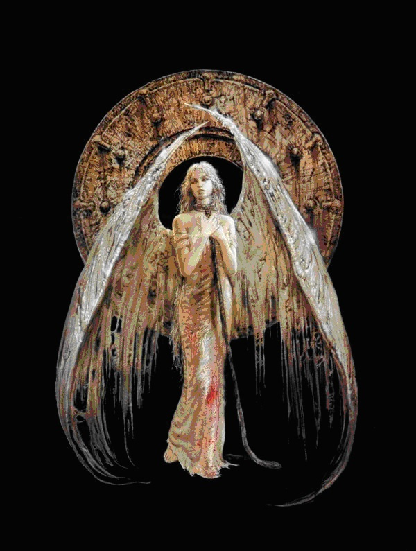

# 素颜的昼与夜 
 [2014-12-07 22:24:11](#data.create_time)

 
一身素白的天使站在塔尖，白玉张开着，像是一双张开的臂膀，拥抱着这浓浓的夜色。 
他抬眼，望见他脚下的世界里灯火辉煌背后腐烂的纹理。 
他笑的凄凉又感伤。 
究竟是多么深沉的爱让他伫立在那里，一望几千年？ 
究竟是多么沉痛的很让他在这诀别的夜里溢满了悲伤？ 
 
生是死者的痛，死是生者的伤。 
那么他又为何在这样的夜里，让他的绝望漫天的飞扬？ 
一身素白的天使站在塔尖，白羽合着，晨光中羽毛翻飞。 
他合了眼，看不见断壁残垣应在清晨露珠中那安静的睡颜。 
 
“希望”是他的祈愿，因为“绝望”是他的名字。 
“守护”是他的祈愿，因为“破坏”是他的名字。 
“完满”是他的祈愿。因为“遗失”是他的名字。 
罪与罚是他的权杖，于是在昼与夜的不断交替中，他的笑成全了一个世界的终结。  