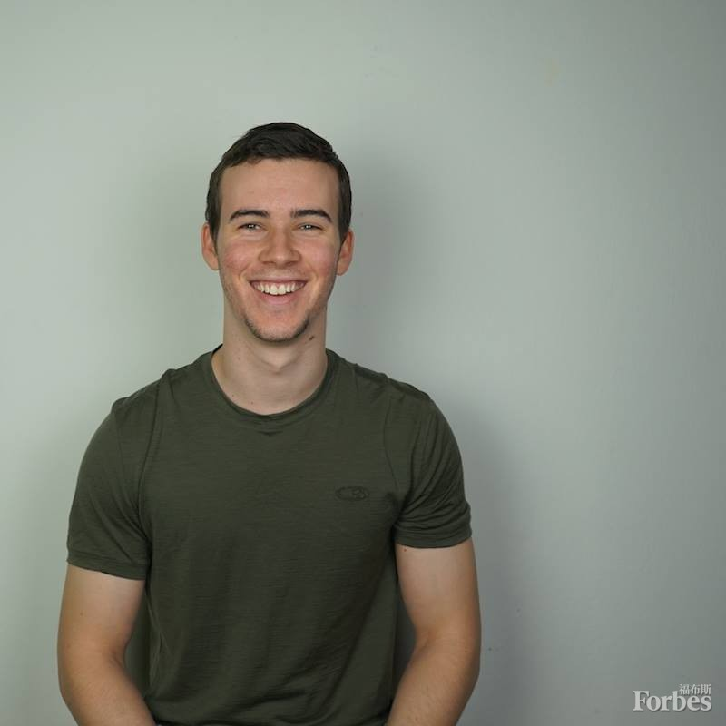

# 这位20岁的年轻人告诉你：如何在一个月内学会西班牙语？
[2015-12-21 08:49:07](#data.create_time) 
 当我凌晨两点跌跌撞撞走进他公寓的时候，他还在半梦半醒中。 
 我刚刚抵达哥伦比亚的麦德林市，接下来的一周我将在这里与我的朋友康纳-格鲁姆斯(Connor Grooms)共事和共度，他是BaseLang的CEO，以及"一个月学会西班牙语-一部语言学习的纪录片"(Spanish In A Month - A Language Learning Documentary)的制作者，该片在12月1日登陆YouTube。这是目前为止我们不期而遇的第三个国家，之前是在美国和西班牙，在那里我们曾在飞机上欣赏过曼哈顿的天际线，并在巴塞罗纳的一个码头与几位将船停靠在船坞的陌生人交上了朋友。 
在使用我“仅存的那点西班牙语”点一份巧克力玉米饼和去舞厅跳雷吉顿舞的某个当口，我成为全球最先见证格鲁姆斯如何在仅仅一个月内就学会西班牙语的五个人之一。 
在我详细介绍之前，你需要了解关于格鲁姆斯的几件事。 
格鲁姆斯是一位数字游民，在5个不同的国家生活，并到访过超过35个国家。他爱上了元学习，过去一年来接受了多个为期一个月的挑战，以向自己，并向公众(如今越来越如此)证明他学习新技能的能力。之前，他管理着一个名为One Month Master的博客，自学网页设计、DJ、电影制作，现在则是西班牙语，学习时间都为一个月。他的自我体验式试验还包括2014年末，他在30天中增加了26磅的肌肉。这促使他成为一名作家，他在一本名为"<a href="http://www.amazon.com/dp/B00RJDCIH4">Eating For Mass</a>"、备受专家赞誉的健身书中，详细介绍了自己从“宅男到型男”的过程。 
那么，格鲁姆斯究竟是如何在一个月内学会西班牙语的呢？我们如何能在很短时间内，基本学会一项技能呢？ 
这并不容易。格鲁姆斯一共花了150个小时，也就是每天5小时，一共30天，用于学习这些知识，同时他还继续做着全职工作。他的成功在于，从数据驱动式的方式中，找出最有效果的学习方法，不论是传统的(比如快闪卡)，还是非传统的(比如在纪录片中他为了学习正确的发音而采用的模仿的方法)。格鲁姆斯做的事情里没有一件是荒唐可笑的。在学习语言时，他只是乐意采纳几十本书和班尼-刘易斯(Benny Lewis)这种世界一流导师提供的建议，然后付诸实践。 

他还在那些真正要紧的事情上付出努力，在学习语言的情况里，就是与人进行交流的能力，而不是追求尽善尽美，这让格鲁姆斯可以设定能够达成的目标。在商务环境下，这可能意味着完成销售，而不是写一份五十页长的商业计划书。对增肌来说，或许就是增加5磅健康脂肪，同时增加26磅肌肉，而不是由于害怕体脂量上升而将不要增加质量放在第一位。 
结果就是，这部纪录片不仅启发他人认真对待自己的爱好，并以不可思议的速度达成学习目标，而且还是创立一家企业的极好方式。 
&nbsp; 
格鲁姆斯将他一个月内学会西班牙语时使用的所有语言学习策略和工具加以总结，创立了<a href="http://baselang.com/">BaseLang.com</a>，目的是帮助其他人也能讲一口流利的西班牙语。BaseLang无条件提供辅导，你无需前往一个讲西班牙语的国家，就能获得最佳的沉浸式语言学习体验，部分原因是该公司将你与母语人士组成一对，让你获得交流的能力，而不是用学习过程中没有真人参与的应用程序帮你学习，让你只专注于特定的词汇或语法时态。如果我在与全球一流公司、思想领袖和职业演说家合作的过程中，以及在格鲁姆斯的各种试验中发现了什么共同点的话，那就是在专家的帮助下，你学习的速度会比自学快十倍。 
如需了解怎样在一个月内学会一样技能，请观看格鲁姆斯新发布的<a href="https://www.youtube.com/watch?v=-RvhtpRnZWQ&amp;feature=youtu.be">纪录片</a>，并将你领会到的元学习策略和建议应用到自己的工作、技能学习或爱好中。 
译 陈岳林&nbsp; 校&nbsp; Lily 