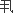

# 食色性也
[2014-12-07 22:24:11](#data.create_time)
孔子在《礼记》里讲"饮食男女,人之大欲存焉。"的确是孔子对于人生的看法--形而下的,不讲形而上的。凡是人的生命,不离两件大事：饮食、
男女。一个生活的问题,一个性的问题。所谓饮食,等于民生问题。男女属于康乐问题,人生就离不开这两件事。有时候看到有关中国文化的文章说"食色性也"是孔子说的,错了,这句话不是孔子说的,是与孟子同时代的告子说的。

##### 解析
子夏曰:贤贤易色,事父母能竭其力,事君能致其身,与朋友交言而有信,虽曰未学,吾必谓之学矣。  
这几句话,是接着证明了学问的目的,不是文学、不是知识,是作人做事。子夏比孔子少四十四岁,他的名字叫卜商。孔子死后,在战国开始的初期,他讲学河西,在战国时期一般对时代有影响的大学者,蒙受他的影响很大。所以这也是我们大家要注意的。领导历史、领导国家社会的,到底还是学问思想。 
现在引用子夏的话,证明学问是什么。我们看原文"贤贤易色",两个贤字,第一个贤字作动词用,因为中国文字有时候是假借的。第二个贤字是名词,指贤人--学问修养好的人。"易色",古人如宋儒他们,是怎么解释的呢？他们对"色"字解作"女色"、"女人"、"男女之色"了。（孔子被人叫打倒,就是这样受冤的。）"贤贤易色"就是看到贤人--有学问道德的人,马上跟他学了。"易色",女色都不要了,太太都不要了,在恋爱中的,把女朋友都丢掉了。如是女方,男朋友也不要了。如果真如宋儒的说法,我认为孔夫子不是圣人了。因为圣人,是不会违反人情的。孔子在《礼记》里
讲"饮食男女,人之大欲存焉。"的确是孔子对于人生的看法--形而下的,不讲形而上的。凡是人的生命,不离两件大事：饮食、男女。一个性的问题,一个生活
的问题。所谓饮食,等于民生问题。男女属于康乐问题,人生就离不开这两件事。有时候看到有关中国文化的文章说"食色性也"是孔子说的,错了,这句话不是孔
子说的,是与孟子同时的告子说的。以后引用文章,不要将错就错,一错再错。  
这个性的问题,究竟先天的性或后天的性呢？以后再讨论。但宋儒解释"贤贤易色",为了作学问,都可以把自己的妻女或丈夫丢开,这是不通的。  
这个"色"字,很简单,就是态度、形色,下面还有证明,所谓"态色"就是态度。"贤贤易色"意思是：我们看
到一个人,学问好,修养好,本事很大,的确很行,看到他就肃然起敬,态度也自然随之而转。这是很明白,很平实的,是人的普通心理,不管一个如何坏的人,看
到一个好人,总会不自觉地对这好人比较友善,这是人之常情。  
"事父母能竭其力"是讲孝道。这句话有一个问题产生了,子夏为什么提到"竭其力"呢？重点在这个"竭"字。
过去一般人讲到对父母的孝顺,是"非孝不可"。其实孝道也要量力而为,孝要竭其力,不要过分了。前一两年,有个年轻人基于天生的（不是教育的）孝心,为了
孝养父母,去做了小偷,犯了法,对于这样行孝的人,在心理道德上,我们觉得这个人"非其罪"也,因为他为了孝顺,为了医母亲的病,结果偷了钱,犯了法,这
是可以原谅的。但是在学问修养上看,对他的批评是"这个人没有受良好的教养"。在道理上来讲,这个青年是好心,但是好心要学识来培植它,使他知道要"竭其
力"而不要做过分的事。中国古人有两句话综合起来的一副对联说："百善孝为先,原心不原迹,原迹贫家无孝子。万恶淫为首,论迹不论心,论心世上少完人。"
其"原心不原迹"就只看他的心孝不孝。比如一个人很穷,想买一罐奶粉给父母吃,但实在没有钱,买不起,因此心里很痛苦,只有希望慢慢积蓄点钱再去买。只要
有这个心,只要他这份情感是真的,我们就不能说他不孝。"原迹贫家无孝子",如果一定要在事实上有表现,那穷人家里就没得孝子了。这个道理非常清楚,我们
用这个道理来解释,就是说明"事父母能竭其力"是尽自己的心力做到了就是孝。  
"事君能致其身"这个"君"字,成为过去打倒孔家店的口实。他们认为这是专制思想,是捧帝王、捧独裁的古老教条。事实上不是这么回事,我们先要了解中国文化的"君"字是什么意思。从文字的字形上看,"君"字古写,头上"尹"字,"尹"字的古写是：。 
我们的文字,是由图案演变而来的,手里拿一根拐杖,下面一个口,代表一个人,这个人年龄大了,学问道德很高,拿根拐杖,也等于指挥杖,所以凡是拿拐杖的,指挥杖的,都是君。后来才转借变成皇帝的专用,其实中国文化中的"君"也不是皇帝的专用词,比如我们过去写封信给平辈,不好称他先生,也不好意思称他老弟;乃至一位老师写给学生,这位老师谦虚一点就称学生"某某君",如果说君是代表皇帝,就是"某某皇帝"了,通吗？没有这回事。日本人学我们中国文化,写信通常都是以君为尊称词。 
这句"事君能致其身"的意思是：不论朋友或同事,他跟你感情好,他了解你、认识你,认为非你帮忙不可,而你
答应了,那他就是君,你既已答应帮忙朋友完成一件事,要抬轿子就规规矩矩一定尽心,答应了就言而有信。"能致其身",竭尽自己身、心的力量。就好比结婚一
样,要做到从一而终。否则当初不要答应,既然答应了,讲作人的道理,就要有信。至于替人家做事的道理就是忠,也就是尽自己的力。不可以表面上愿意帮忙,做
出部下很恭敬的样子,背地里却一切不同意,反而捣乱扯腿。即使在外面做主管,也常会碰到这些事。这就是作人的"臣道"不够,简单说就是不诚恳。  
 所以"贤贤易色,事父母能竭其力,事君能致其身。"白话解释就是看到好的人能肃然起敬,在家能竭心尽力地爱
家庭,爱父母。在社会上做事,对人、对国家,放弃自我的私心,所谓许身为国。还有"与朋友交言而有信",这句话再三提到,在感情上说,每个人都认为做到了
对朋友言而有信。据我自己的反省,虽然很想彻底做到,事实上却很困难。有时候对朋友答应了的事做不到,心里非常难过,为了自己道德的要求,想尽办法去做,
所以仔细研究起来,"与朋友交言而有信"这句话,实在很不容易。所以子夏说,能够做到这样,"虽曰未学,吾必谓之学矣。"尽管这个人没有读过一天书,我一
定说这人真有学问,这不是说明"学而时习之"并不是说一定读死书吗？  
##### 论证
语出《孟子》--告子曰：“食色性也。仁,内也,非外也。义,外也,非内也。’原来是孟子与告子辩论,"食色性也"这句话是只不过是告子的论点之一罢了,看来也不是孟子的观点。那么我们平时经常引用这句话,并先说上"连圣人都说过",岂不是大错特错了吗？ 
      告子主张性无善无不善论,与荀子主张的性恶论及孟子主张的性善论构成了为对人性的
三种认识。告子所提出的"食色性也"这句话,是为了证明自己关于性无善无不善论的,告子主张"生之谓性"学,也就是主张食、色为人类生存所必需。在与孟子
争辩时,其实孟子对告子的这句话并未持反对的态度,也就是说孟子虽然是持性善论,也是基本上同意告子的这种观点的,从什么地方可以看得出来呢？一、从下面
的辩论可以看得出来,即孟子并没有在此批判食色二字,只是从外与内进行批驳；二、这还要从《孟子》这本书里面去找答案,这一个证明的过程甚是罗嗦,去找的
过程,那真是累呀！翻了大半天的《孟子》,终于找到可以证明的句子,这是孟子与齐宣王进行对话时所提到的,孟子一如既往地宣扬仁政思想,而齐宣王却如幼童
般找出一些可笑的借口来拒绝实行仁政,如他提到他这个人"好货"又"好色",而孟子进行了针锋相对的劝说："……王如好货,与百姓同之,于王何
有？""……当是时也,内无怨女,外无旷夫。王如好色,与百姓同之,于王何有？"从这可以看出孟子并不主张除去人的好货好色的私心。  
      
孔子说："饮食男女,人之大欲存焉！"告子又主张："食、色,性也！"孟子也不主张去除人的好货好色之私心,可见平时人们在引用"食色性也"这句话是并不
是多么太离谱的事情,但至少再不能说"孔子曾说过"这样的话了,你可以说"我们的老祖先都曾经说过"这样的话,就比较准确了。三人有一贯的思想,这与他们
同属儒家学派可能有关,据后人考证,告子当属于儒家弟子,他们三人都不约而同地尊重"人性",他们身上闪耀着人道主义的光辉,只可惜后人牵强附会,将好端
端一锅味美鲜汤给弄馊了,比如宋儒理学家们,固然他们也有些许的贡献。   
 ##### 影响
 时至今日,人们更是对"食、色"这两个方面趋之若骛,几乎达到了无所不用其极的地步,人们正在陷入越来越混乱的境地之中。太重视"吃"了,结果造成了对大自
然的严重破坏及国家资源的严重浪费；太重视"色",结果造成了无数的良家女子铤而走险,从事肮脏的性交易,社会风气败坏,人心思乱。面对这种局面,如果再
不反思,将会有巨大的抱复。实际上现在的抱复已经出现了。很多例子可以证明这一点,比如最具震撼力是零三年的"非典"及今年的"禽流感",这实际上是大自
然对人类急功近利行为的一种巨大的无情的报复行为,还有爱滋病的泛滥更是对人类滥交行为的巨大的报复。人们对"食、色"的不加节制,使相关的商业行为完全
蔑视人类的生存权利,只要能赚钱就行,具体一点说,人们所吃的已经几乎没有什么能令人放心了,比如大米是有毒的、月饼是陈陷的、蔬菜农药残留严重超标、牛
肉是注水的、猪肉里面含有瘦肉精并且有的猪肉是用垃圾喂大的、鱼是喂激素长大的、面粉里含有漂白剂严重超标、一些食品中竟含有苏丹红、垃圾食品如洋快餐
（据说薯条里面含有致癌成份）、酒里加有敌敌畏等,不胜枚举。  
 ##### 警 醒
"食色性也"本是古代先贤对人的天性的一种尊重,没想到后人却不加思考地继承并发扬光大,以至全世界没有不知道中国美食的,时至今日,这种观念实在应该改
改了。建立节约型社会,不但是国家的事情,更是个人应必须做的。人们当然应追求吃的好,玩的好,但是不能没有节制,不能变本加厉地去破坏大自然,去做一些
太过放纵的事情。当法律不能禁止一些行为时,神秘的力量却横空出世,用来警醒世人应做什么,不应做什么！当人们的神经变得极为麻木,不为所动时,也许将会
有更大的灾难降临到我们这个美丽的地球上 