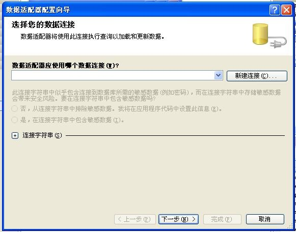
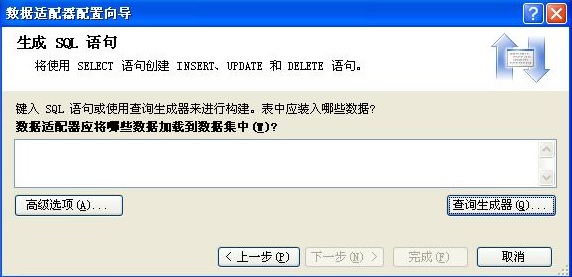

# 数据库

 
1. 调用数据库内容（连接） 
``` 
     using System.Data.SqlClient;//添加命名空间
          //添加  sqlCommand  和sqlConnection控键
     //-------------------------新建数据库---------------------------------------------
SqlConnection 实例数据库名 = new SqlConnection();           新建数据库的实例
   实例数据库名.ConnectionString = ("数据库属性");
                         e.g.数据库属性:   Data Source=(local);  (local)表示调用本地数据库
Initial Catalog=Note;  Note为数据库名称
Integrated Security=True
   实例数据库名.Open();


// -------------------------新建命令----------------------------------------------
            SqlCommand 命令名 = new SqlCommand();
            命令名.Connection =实例数据库名;
            命令名.CommandText = "命令条件";
                                     e.g.命令条件: select*from dbo.name //搜索名为name的表
//-------------------------操作-----------------------------------------------            
SqlDataReader 操作名= 命令名.ExecuteReader();
            while (操作名.Read())                读取所有内容
            {  操作内容;
                                    e.g.操作内容 
listBox.Items.Add(操作名[条件].ToString());//将命令中获得的表name中满足条件的数据添加到列表listBox中,条件可以为双引号中加具体条件的内容的形式也可为索引值,如 条件为1:表示在表name中对应的第1列的内容

             }   
         操作名.Close();
            实例数据库名.Close();
 ```  
2. 调用数据库内容（非连接）

向导 创建<br>
添加.net控键——sqlDataAdapter <br>
出现sqlDataAdapter  数据适配器配置向导<br>
<br>
* 新建数据库
 * 选择 数据命令类型——使用SQL语句
 * 出现 生成SQL语句对话<br>

<br>
     查询生成器：添加 需要使用表>选中所需数据列 >完成<br>
     高级选项：选择一些自动生成的东西<br>
 * 完成<br>
 代码 创建  并实现查找功能:<br>
```  
//---------------创建数据库---------------------
SqlConnection 新数据库名 = new SqlConnection();
            新数据库名.ConnectionString="新数据库信息 ";
            新数据库名.Open(); 
//----------------创建命令（即 查找功能）----------------
            SqlCommand 新命令名 = new SqlCommand();
            新命令名.Connection =新数据库名;

            新命令名.CommandText = "select *from 位置  where 被查找条件='查找条件'";
                                          查找条件为字符串 对于文本框内容的使用 
                                           e.g. 查找条件=" + textBox1.Text + "
                                               内涵：一个双引号加 文本框内容加一个双引号 反正就是一定要这么写就对了 不这么写就是错的 嘿嘿 这就叫规则！！！
//---------------用数据适配器打开连接数据---------

            SqlDataAdapter 数据适配器名 = new SqlDataAdapter();
            数据适配器名.SelectCommand=新命令名;
//--------------创建 数据集----------------------------           
            DataSet1 新数据集对象名 =new DataSet1();
            数据适配器名.Fill(新数据集对象名, "新数据集名（自定义）");
//-----------------窗口操作--------------------------
            this.dataGridView控键名.DataSource =新数据集对象名.Tables["新数据集名"];
            ``` 

 