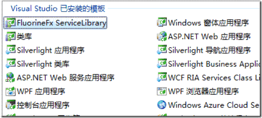
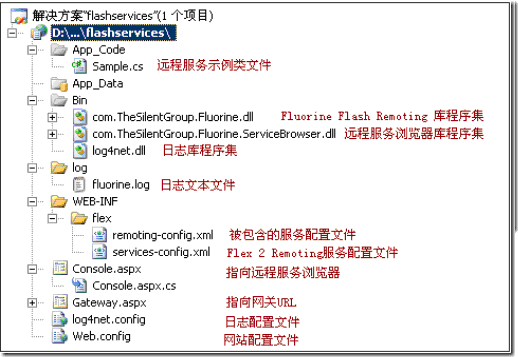
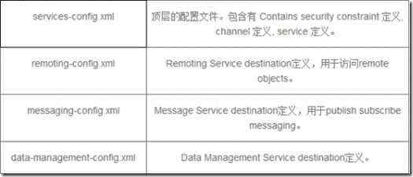
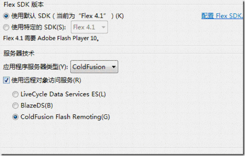
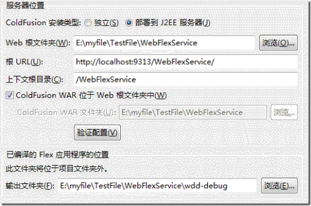
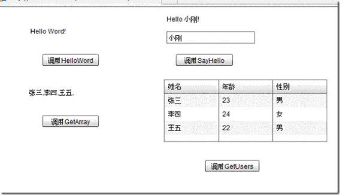

# 数据交互的三种方式

1. Webservice通讯<br>
首先简单的建立个web项目,添加一个web服务,最简单的定义一个方法,比如HelloWorld:<br>
```
   [WebMethod]
   public string HelloWorld() {
          return "Hello World";
          }
```
在Flex里面建立项目,并添加一个mxml文件…名字随便..<br>
```
<fx:Declarations>
<s:WebService id="WS"   wsdl="http://localhost:3431/WebSite1/WebServiceFlex.asmx?wsdl"  fault="Alert.show(event.fault.faultString,'Error')" showBusyCursor="true"> //错误提示
<s:operation name="HelloWorld" resultFormat="object" result="onResult(event);"></s:operation>   
//object":调用的webservice 里面的方法名称 onResult(event):回调函数
</s:WebService>
</fx:Declarations>
//下面在Script标签里面写上Flex的回调函数onResult(event);
import mx.controls.Alert;
import mx.events.ResizeEvent;
import mx.rpc.events.ResultEvent;
internal function onResult(evt:ResultEvent):void{
         Alert.show(evt.result.toString());//返回结果
         }
//在页面上放一个按钮来触发这个webservice 
<mx:Button x="26" y="209" label="获取webservice的信息" fontSize="12" click="WS.HellowWorld.send()"></mx:Button> 
//运行就可以看到效果了
```


2. HttpService通讯<br>
```
  <mx:HTTPService id="menus" resultFormat="xml" url="dataAsset/rooms.xml" result="httpservice1_resultHandler(event)"></mx:HTTPService> 
```
resultFormat:<br>
指示如何反序列化由 HTTP 调用返回的结果的值。该项目的值根据以下条件确定： <br>
  * 返回的是 XML 还是名称/值对。<br> 
  * 访问结果的方式；可以将结果作为 object、text 或 XML 进行访问。 默认值为 object。允许使用的值包括： <br>
  * object 返回的值为 XML 并且按照 ActionScript 对象树分析。此为默认。 <br>
  * array 返回的值是 XML 并且按照 ActionScript 对象树分析。但是，如果顶级对象不是数组，将创建一个新数组并且将结果设置为第一个项目。如果 makeObjectsBindable 为 true，则该数组将被包装在 ArrayCollection 中。<br> 
  * xml 返回的值为 XML 并且作为 ActionScript XMLnode 对象中的文本 XML 返回。<br> 
  * flashvars 返回的值是包含由 & 符号分隔的名称=值对的文本，该文本被分析为 ActionScript 对象。<br> 
  * text 返回的值为文本并且未经处理。<br> 
  * e4x 返回的值为 XML 并且作为 ActionScript XML 对象中的文本 XML 返回，可以使用 ECMAScript for XML (E4X) 表达式进行访问。 <br>
Result : 当 HTTPService 调用成功返回时分派。 <br>
Url: 服务的位置。如果指定 url 并指定非默认目标，则 services-config.xml 文件中的目标必须允许该指定的 URL。<br> 
httpservice1_resultHandler(event) 是返回结果调用的函数:<br>
```
  protected function httpservice1_resultHandler(event:ResultEvent):void{
Var roomsXml=new XML(event.result);
menuInfo=roomsXml.node;
trace(menuInfo);
}
```
Httpservice比较简单.还有一个技巧是url可以指定一个aspx页面的连接地址, 在这个aspx 里面通过Respince.write() 输出一个xml 格式的字符串也可以达到这种效果.比较灵活。 <br>
 
3. 利用Remoting 与数据库通讯<br>
	需要的组件 <br>
	Remoting网关 : FluorineFx 一个第三方的组件 下载地址 <br>
	当然还有 Vs2008 <br>
	介绍 <br>
	FluorineFX是一个开源库，提供了一种在.NET framework下对Flex/Flash的远程过程调用，Flex数据服务和实时数据的使用技术。 <br>
	能被.NET frameworks支持的FluorineFx有： <br>
	Microsoft .NET Framework 1.1 (1.1.4322) <br>
	Microsoft .NET Framework 2.0 (2.0.50727)<br> 
	Microsoft .NET Framework 3.5 (3.5.21022.8)<br> 
	Microsoft .NET Framework 4.0 <br>
	Mono 1.2.4 <br>
	.NET frameworks 支持向下兼容，所以新版本的框架将运行的二进制集会被定位到先前版本的框架 <br>
	Fluorine是一种开源的AMF(ActionScript Messaging Formatter)网关，专门负责Flex3.0与.Net交互时的数据类型转换。Fluorine现支持ActionScript 2.0和ActionScript 3.0，所以Fluorine也可作为Flash与.Net交互时的AMF网关。 <br>
	安装 <br>
	安装好FluorineFX 在Vs2008下新建项目,可以看到多了一个FluorineFX ServiceLibrary <br>
	<br>
	OK,说明你的FluorineFX安装成功了.创建项目. <br>
	<br>
	此图来源于网上..这个图是很形象滴..不过少了些文件  <br>
	如果不支持Fluorine模板的话.那就需要你自己手动配置Flash Remoting了,大致和上面的目录差不多就可以..具体的网上应该有介绍, <br> 
	上图flex文件夹下少了两个xml文件 这里贴出来:  <br> 
	<br>
	如果你使用的是跟我一样的环境的话,这些配置默认就可以,.我也没有做过深入研究 <br>
	创建好之后 我的地址是 http://localhost:9313/WebFlexService/ 这个要留着.. <br>
	创建 Flex项目 <br>
	我使用的是Adobe Flash Builder 4所以这里创建的时候或许有些不同 <br>
	创建Flex项目.. <br>
	<br>
	选择ColdFusion ,选中该ColdFusion Flash Remoting <br>
	Next! <br>
	<br>
	这个是我的配置,但总感觉不对,咱是做.net的,还得选中部署到J2EE服务器,心中有些不爽.但是选择独立那个,总是配置不成功,也就只能这样了..  <br>
	利用 Remoting通讯可以接收服务器端传递的 带参数,数组,集合等等格式的数据.  <br>
	这里演示这几种传送数据的方式  <br>
.net端代码:  <br>
	```
	  [RemotingService("Fluorine sample service")]  //这句话很重要
	public class Sample{
	public Sample(){}
	public string HelloWord(){
	return "Hello Word!";}
	public string SayHello(string name){
	return "Hello " + name + "!";}
	public string[] GetArray(){
	string[] array = new string[] { "张三", "李四", "王五" };
	return array;}
	public List<User> GetUsers(){
	List<User> users = new List<User>();
	User user = new User();
	user.Name = "张三";
	user.Age = 23;
	user.Sex = "男";
	users.Add(user);
	user = new User();
	user.Name = "李四";
	user.Age = 24;
	user.Sex = "女";
	users.Add(user);
	user = new User();
	user.Name = "王五";
	user.Age = 22;
	user.Sex = "男";
	users.Add(user);
	return users;
	}
	}
	```
Flex端代码:<br>
	```
	<fx:Script>
	<![CDATA[
	import mx.collections.ArrayCollection;
	import mx.containers.Form;
	import mx.controls.Alert;
	import mx.rpc.events.FaultEvent;
	import mx.rpc.events.ResultEvent;
	public function RemoteResult(cvt:ResultEvent):void{
	var str:String = "";
	switch(cvt.currentTarget.name){
	case "HelloWord"://无参数
	str = cvt.result as String;
	this.showtxt.text = str;
	break;
	case "SayHello"://带参数
	str = cvt.result as String;
	this.SayHellotxt.text = str;
	break;
	case "GetArray"://数组
	for(var i:int = 0;i<cvt.result.length;i++){
	this.showGetArraytxt.text += cvt.result[i].toString() + ",";
	}
	break;
	case "GetUsers"://传递实体对象
	var userArray:ArrayCollection = new ArrayCollection();
	for(var j:int = 0;j<cvt.result.length;j++){
	var user:User = cvt.result[j] as User;
	userArray.addItem(user);
	}
	this.dgGrid.dataProvider = userArray;
	break;
	}
	}
	public function RemoteFault(cvt:FaultEvent):void{
	Alert.show("Message:" + cvt.fault.faultString,"出错");}
	]]>
	</fx:Script>
	<fx:Declarations>
	<mx:RemoteObject
	id="sampleRemoteObject"
	destination="fluorine"
	source="Sample"
	showBusyCursor="true">
	<!--这里是.NET中的方法，name = 方法名 -->
	<mx:method name="HelloWord" result="RemoteResult(event)" fault="RemoteFault(event)"></mx:method>
	<mx:method name="SayHello" result="RemoteResult(event)" fault="RemoteFault(event)"></mx:method>
	<mx:method name="GetArray" result="RemoteResult(event)" fault="RemoteFault(event)"></mx:method>
	<mx:method name="GetUsers" result="RemoteResult(event)" fault="RemoteFault(event)"></mx:method>
	</mx:RemoteObject>
	</fx:Declarations>
	<mx:Text id="showtxt" text="" x="63" y="34" width="145" height="23">
	</mx:Text>
	<s:Button x="87" y="85" label="调用HelloWord" click="sampleRemoteObject.HelloWord()" ></s:Button>
	<s:Label id="SayHellotxt" x="312" y="17" text="" width="160" height="22"></s:Label>
	<s:Button x="329" y="85" label="调用SayHello" width="103" click="sampleRemoteObject.SayHello(this.nameInput.text)"></s:Button>
	<s:TextInput id="nameInput" x="312" y="44" width="160"></s:TextInput>
	<s:Label x="63" y="149" id="showGetArraytxt" text="" width="145" height="24"></s:Label>
	<s:Button x="87" y="196" label="调用GetArray" width="102" click="sampleRemoteObject.GetArray()"></s:Button>
	<mx:DataGrid id="dgGrid" x="307" y="131" width="296" height="113">
	<mx:columns>
	<mx:DataGridColumn headerText="姓名" dataField="Name"></mx:DataGridColumn>
	<mx:DataGridColumn headerText="年龄" dataField="Age"></mx:DataGridColumn>
	<mx:DataGridColumn headerText="性别" dataField="Sex"></mx:DataGridColumn>
	</mx:columns>
	</mx:DataGrid>
	<s:Button x="382" y="277" label="调用GetUsers" click ="sampleRemoteObject.GetUsers()"></s:Button>
	```
效果图:<br>

 
 
 
 
