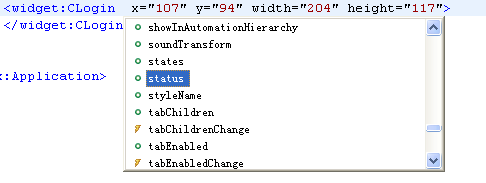

# 自定义控件

前期准备：<br>
点击File菜单 -> New -> MXML Component，然后弹出一个对话框。在对话框中输入组件名，选择此组件继承的类型，如：Canvas，DataGrid，ComboBox …… 等。然后选择组件的大小，点击Finish即可。<br>
关于组件继承的类型，假设Based on Canvas，那么组件的根元素即为mx:Canvas，此元素的含义为空白面板，那么设计人员可以任意在这个面板容器内放置任何东西，就像开发主程序一样。那么此组件类似一个容器。<br>
如果Based on ComboBox，那么根元素即为mx:ComboBox，此元素的含义为下拉框，那么设计人员可以在下拉框的内部任意定制内容或代码，那么此组件定制了一个下拉框。<br>
例，登录组件：<br>
制作组件：<br>
首先按照上面的步骤新建一个组件，名为CLogin.mxml，Based on TitleWindow。TitleWindow元素代表有标题的窗口。 然后切换到Design视图，选择这个TitleWindow窗口，在属性框里编辑标题（Title属性），输入“用户登录”。此时的代码大体如下：<br>
```
<?xml version="1.0" encoding="utf-8"?>
<mx:TitleWindow xmlns:mx="http://www.adobe.com/2006/mxml" width="286" height="208" layout="absolute" title="用户登录">
</mx:TitleWindow>
//然后我们加入Form控件并填入内容（FormItem），然后添加按钮以便提交，此时代码如下：
<mx:TitleWindow xmlns:mx="http://www.adobe.com/2006/mxml" width="286" height="208" layout="absolute" title="用户登录">
<mx:Form width="248" height="100" label="Button" x="10" y="10">
<mx:FormItem label="用户名" fontSize="12">
<mx:TextInput id="username" width="158" height="28" fontSize="15" textAlign="left"></mx:TextInput>
</mx:FormItem>
<mx:FormItem label="密码" fontSize="12">
<mx:TextInput id="password" width="159" height="30" fontSize="15" textAlign="left" displayAsPassword="true"></mx:TextInput>
</mx:FormItem>
</mx:Form>
<mx:Button id="loginbtn" label="登录" textAlign="center" fontSize="12" x="190" y="118"/></mx:Button>
</mx:TitleWindow>
```
上面的登录只是布局，没加入事件处理程序，但是这已经可以算是一个登录组件了（虽然只能看不能用，呵呵）组件制作完毕，然后就可以使用他了<br>
使用组件：<br>
打开主程序，进入Design视图，查看左下角的组件浏览器。你会发现在Custom下多出来一个CLogin来，把它拖入设计面板，哈，登录组件就显示在面板上了，就这么简单。代码可能会如下：<br>
```
<?xml version="1.0" encoding="utf-8"?>
<mx:Application xmlns:mx="http://www.adobe.com/2006/mxml" layout="absolute" xmlns:ns1="*">
<mx:Script>
<![CDATA[
import mx.controls.Alert;
private function btnClick() : void {
 Alert.show("test","Test");
}
]]>
</mx:Script>
<mx:Button id="bb" x="107" y="37" label="Button" click="btnClick()"/>
<ns1:CLogin x="107" y="94" width="204" height="117">
</ns1:CLogin>
</mx:Application>
```
修改命名空间xmlns:ns1变成你想要的比如xmlns:widget，最后的代码：<br>
示例代码：Hello.mxml：<br>
```
<?xml version="1.0" encoding="utf-8"?>
<mx:Application xmlns:mx="http://www.adobe.com/2006/mxml" layout="absolute" xmlns:widget="*">
<mx:Script>
<![CDATA[
import mx.controls.Alert;
 private function btnClick() : void {
  Alert.show("test","Test");
  }
 ]]>
</mx:Script>
<mx:Button id="bb" x="107" y="37" label="Button" click="btnClick()"></mx:Button>
<widget:CLogin x="107" y="94" width="204" height="117">
</widget:CLogin>
</mx:Application>
```

自定义组件的属性：<br>
看到这里大家也都应该清楚地知道，大部分Flex控件都有事件属性，比如click，move等，自定义组件会继承他们Based on 的元素的属性和事件，那么我们的CLogin组件（也可以称之为自定义元素）就会继承mx:TitleWindow的全部可以继承的属性（属性、事件、特效、样式等等），那么它的特有属性如何来做呢？下面我们来为其加上其特有属性。<br>
加入自定义属性：<br>
示例代码CLogin.mxml：<br>
```
<mx:TitleWindow xmlns:mx="http://www.adobe.com/2006/mxml" width="286" height="208" layout="absolute" title="用户登录">
 <mx:Script>
<![CDATA[
[Inspectable]
public var status : String;
]]>
 </mx:Script>
<mx:Form width="248" height="100" label="Button" x="10" y="10">
<mx:FormItem label="用户名" fontSize="12">
<mx:TextInput id="username" width="158" height="28" fontSize="15" textAlign="left"></mx:TextInput>
</mx:FormItem>
<mx:FormItem label="密码" fontSize="12">
<mx:TextInput id="password" width="159" height="30" fontSize="15" textAlign="left" displayAsPassword="true"></mx:TextInput>
</mx:FormItem>
</mx:Form>
<mx:Button id="loginbtn" label="登录" textAlign="center" fontSize="12" x="190" y="118"></mx:Button>
</mx:TitleWindow>
```
首先我们加入一个属性status，修饰这个属性的元数据标签[Inspectable]的意思是，叫编译器和Flex Builder可以看到这个属性，并自动提示：<br>
<br>
加入自定义事件：<br>
首先用元数据标签给CLogin添加自定义事件：<br>
示例代码CLogin.mxml：<br>
```
<mx:TitleWindow xmlns:mx="http://www.adobe.com/2006/mxml" width="286" height="208" layout="absolute" title="用户登录">
<mx:Metadata>
[Event("btnClicked")]
</mx:Metadata>
<mx:Script>
<![CDATA[
[Inspectable]
public var status : String;
]]>
</mx:Script>
<mx:Form width="248" height="100" label="Button" x="10" y="10">
<mx:FormItem label="用户名" fontSize="12">
<mx:TextInput id="username" width="158" height="28" fontSize="15" textAlign="left"/>
</mx:FormItem>
<mx:FormItem label="密码" fontSize="12">
<mx:TextInput id="password" width="159" height="30" fontSize="15" textAlign="left" displayAsPassword="true"/>
</mx:FormItem>
</mx:Form>
<mx:Button id="loginbtn" label="登录" textAlign="center" fontSize="12" x="190" y="118"></mx:Button> 
</mx:TitleWindow>
```
前面提到，MXML相当于一个类，那么mx:Metadata标签就相当于给这个CLogin类加上元数据标签。<br>
标签为事件标签，内容为[Event("btnClicked")]，意思是自定义事件，名称为btnClicked。<br>
然后我们给CLogin的登录按钮加入click事件：<br>
```
<mx:TitleWindow xmlns:mx="http://www.adobe.com/2006/mxml" width="286" height="208" layout="absolute" title="用户登录">
<mx:Metadata>
[Event("btnClicked")]
</mx:Metadata>
<mx:Script>
<![CDATA[
[Inspectable]
public var status : String;
private function login (): void {
 dispatchEvent(new Event("btnClicked"));
 }
]]>
</mx:Script>
<mx:Form width="248" height="100" label="Button" x="10" y="10">
<mx:FormItem label="用户名" fontSize="12">
<mx:TextInput id="username" width="158" height="28" fontSize="15" textAlign="left"></mx:TextInput>
</mx:FormItem>
<mx:FormItem label="密码" fontSize="12">
<mx:TextInput id="password" width="159" height="30" fontSize="15" textAlign="left" displayAsPassword="true"></mx:TextInput>
</mx:FormItem>
</mx:Form>
<mx:Button id="loginbtn" click="login()" label="登录" textAlign="center" fontSize="12" x="190" y="118"></mx:Button>
</mx:TitleWindow>
```
在按钮被单击(click)的时候，我们设定执行了login方法，login方法执行命令dispatchEvent(new Event("btnClicked")) 意思是dispatchEvent发送事件通知，通知组件你自定义的btnClicked事件已经触发了。到这里，我们通过自定义组件CLogin的登录按钮来触发btnClicked事件已经完成。<br>
<br>
使用自定义事件：<br>
这样，我们在主程序里就可以利用这个事件了：<br>
示例代码Hello.mxml：<br>
```
<?xml version="1.0" encoding="utf-8"?>
<mx:Application xmlns:mx="http://www.adobe.com/2006/mxml" layout="absolute" xmlns:widget="*">
<mx:Script>
<![CDATA[
import mx.controls.Alert;
private function btnClick() : void {
Alert.show("test","Test");
 }
private function btnClickHandler(event: Event) : void {
 Alert.show("Event btnClicked Called");
}
]]>
</mx:Script>
<mx:Button id="bb" x="107" y="37" label="Button" click="btnClick()"></mx:Button>
<widget:CLogin btnClicked="btnClickHandler(event)" x="107" y="94" width="204" height="117">
</widget:CLogin>
</mx:Application>
```
这样，一但CLogin组件里的登录按钮被单击就会触发btnClicked事件，从而执行主程序的btnClickHandler方法，弹出提示框：Event btnClicked Called<br><br>
加入自定义效果：<br>
效果是与事件不可分割的，比如之前的例子，showEffect是控件的显示来出来，也就是说visible变为true会触发showEffect所设定效果。那么自定义效果也是一样，与事件紧密联系在一起，比如btnClicked事件发生的时候要产生某种自定义效果，则在CLogin.mxml中添加效果标签：<br>
```
<mx:TitleWindow xmlns:mx="http://www.adobe.com/2006/mxml" width="286" height="208" layout="absolute" title="用户登录">
<mx:Metadata>
[Event("btnClicked")]
[Effect(name="btnClickedEffect", event="btnClicked")]
</mx:Metadata>
<mx:Script>
<![CDATA[
[Inspectable]
public var status : String;
private function login (): void {
dispatchEvent(new Event("btnClicked"));
}
 ]]>
</mx:Script>
<mx:Form width="248" height="100" label="Button" x="10" y="10">
<mx:FormItem label="用户名" fontSize="12">
<mx:TextInput id="username" width="158" height="28" fontSize="15" textAlign="left"/>
</mx:FormItem>
<mx:FormItem label="密码" fontSize="12">
<mx:TextInput id="password" width="159" height="30" fontSize="15" textAlign="left" displayAsPassword="true"/>
</mx:FormItem>
</mx:Form>
<mx:Button id="loginbtn" click="login()" label="登录" textAlign="center" fontSize="12" x="190" y="118"></mx:Button>
</mx:TitleWindow>
```
使用自定义效果：<br>
 示例代码Hello.mxml：<br>
```
<?xml version="1.0" encoding="utf-8"?>
<mx:Application xmlns:mx="http://www.adobe.com/2006/mxml" layout="absolute" xmlns:widget="*">
<mx:Script>
<![CDATA[
import mx.controls.Alert;
private function btnClick() : void {
Alert.show("test","Test");
 }
private function btnClickHandler(event: Event) : void {
Alert.show("Event btnClicked Called");
}
]]>
</mx:Script>
<mx:Button id="bb" x="107" y="37" label="Button" click="btnClick()"/>
<widget:CLogin btnClickedEffect="myEffect" btnClicked="btnClickHandler(event)" x="107" y="94" width="204" height="117">
</widget:CLogin>
<mx:Blur id="myEffect" blurXFrom="100" blurYFrom="100" blurXTo="0" blurYTo="0"></mx:Blur>
</mx:Application>
```
加入自定义样式：<br>
```
package{
import mx.core.UIComponent;
[Style(name="borderColor",type="uint",format="Color",inherit="no")]
[Style(name="fillColor",type="uint",format="Color",inherit="no")]
public class CustomCircle extends UIComponent {
public function CustomCircle(){
super();
}
override protected function updateDisplayList(unscaledWidth:Number,
unscaledHeight:Number):void {
super.updateDisplayList(unscaledWidth, unscaledHeight);
graphics.lineStyle(1, getStyle(“borderColor"), 1.0);
graphics.beginFill(getStyle(“fillColor"),1.0);
graphics.drawEllipse(0,0,100,100);
}
}
}
```

之前举的例子都是MXML的，那么这次就换为AS的例子，事实上都是相等的，如果是MXML的话则在mx:Metadata m内写入元数据标记[Style(name="fillColor",type="uint",format="Color",inherit="no")]等。<br><br>
使用自定义样式：<br>
```
<?xml version="1.0" encoding="utf-8"?>
<mx:Application xmlns:mx="http://www.adobe.com/2006/mxml" xmlns:comps="*" backgroundColor="#FFFFFF">
<mx:Panel title="Style Sample" width="200" height="200" paddingTop="10" paddingLeft="10" paddingRight="10" paddingBottom=" 10" layout="horizontal">
<comps:CustomCircle borderColor="#000000" fillColor="#FF0000"></mx:comps>
</mx:Panel>
</mx:Application>
```
<a href="http://blog.csdn.net/isaaq/article/details/1889400">出处</a>
  