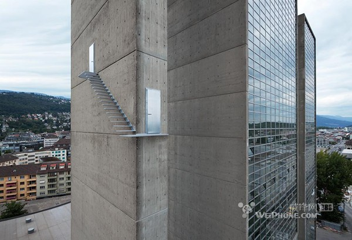
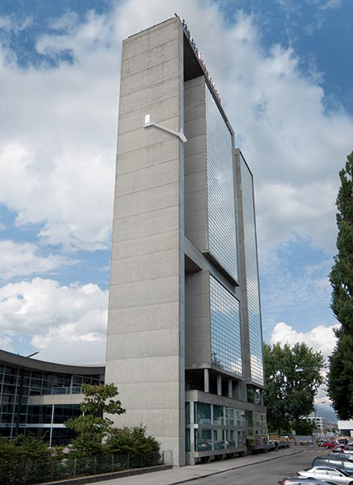
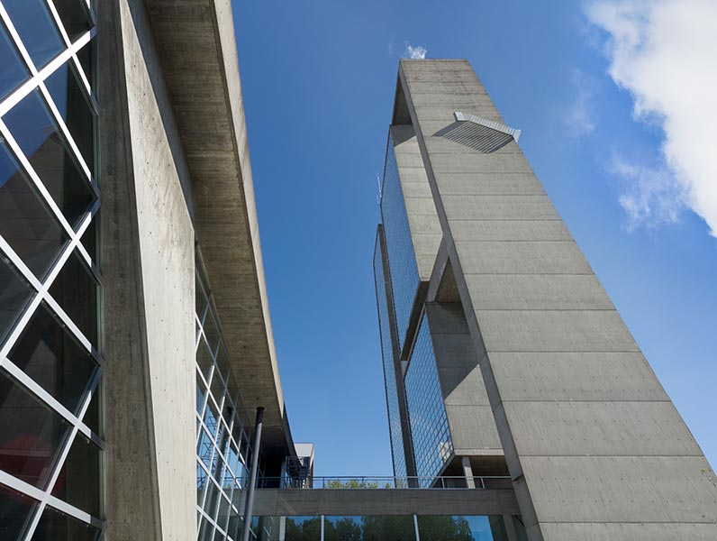

# 世界最可怕的楼梯 Beautiful Stairs 
[2015-09-30 14:09:12](#data.create_time) 
这是一座号称是世界最可怕的楼梯， 
由国外建筑师Sabina Lang以及Daniel Baumann 共同设计，由铝制材料以及其他金属建成。 
这座楼梯的可怕之处在于，它不仅仅位置高，置身室外。 
而且还没有栏杆扶手或者其他的安全防护设施，这也许是通往天堂最快捷的道路了。 
这座楼梯座落在瑞士的一个无名小镇上，如果能去瑞士旅游，一定要弄到详细地址。 
   	 
* [现场照片](#album.list) 
  * 局部 
  * 全局 
  * 仰视 

Sabina Lang *1972 in Berne, Daniel Baumann *1967 in San Francisco 
Technique: steel zincked, aluminium anodized 
Location: Stadt Biel | City of Biel-Bienne 
 
