# 动物的肖像 
[老板，年底不给开双薪我们就这个样子去你家拜年啦](#data.desc) 
[转自:https://abduzeedo.com/adorable-zoo-portraits-yago-partal](#data.link) 
人类的进化虽然经历了几千万年，但在不可否认在人类身上还有保留着某些动物的本能，即便我们更加理性和智慧，会控制自己的情绪并且选择怎样去掩盖缺点，但特殊时刻和环境下还是会暴露出些许的兽性。 
居住在巴塞罗那的摄影艺术家 Yago Partal 拍摄了一组足以令人捧腹的创意作品 Zoo Portraits ，作品中各种各样的动物穿上了人类的衣服还真像那么回事，它们好像经过了精心的打扮然后特意来找 Yago 拍身份证照片的，不过只要您仔细看这些动物的服饰很快就会发现，其实摄影师为每个动物选择的每一套服装都是别有用心的，下了不少功夫，不信您仔细看一下吧。 
   	 
* [动物的肖像](#album.list) 
  * 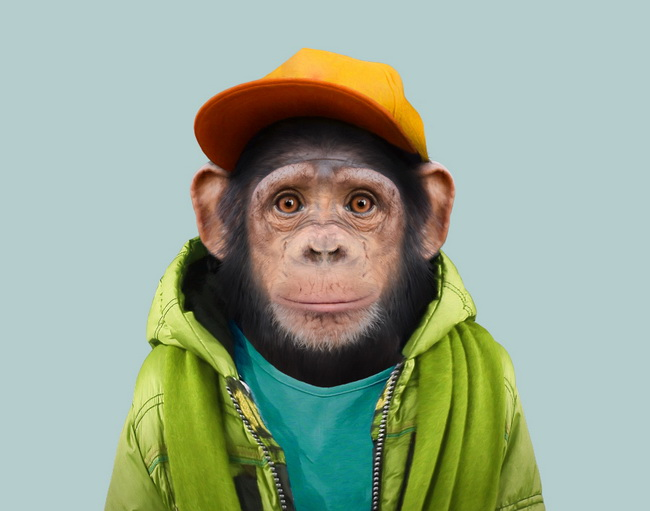
  * 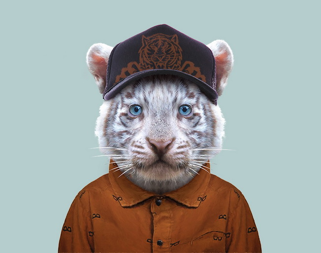
  * 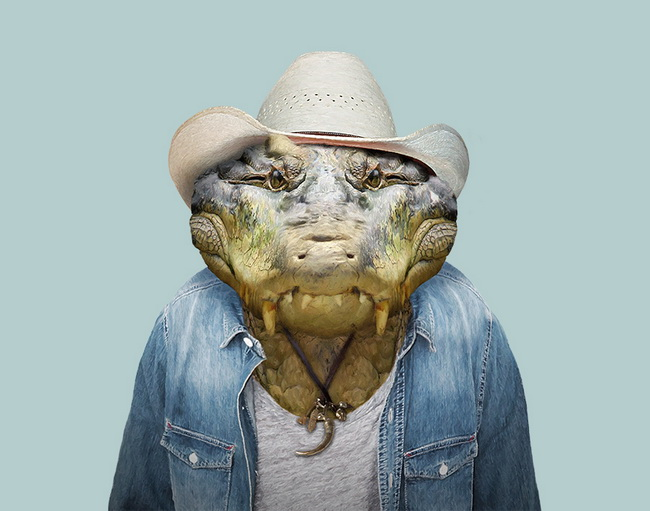
  * 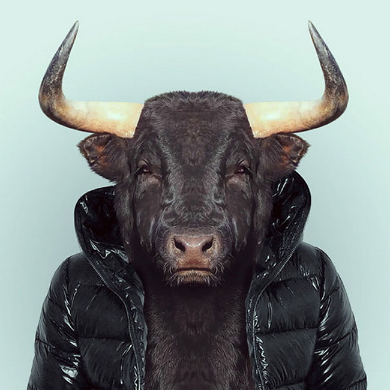
  * 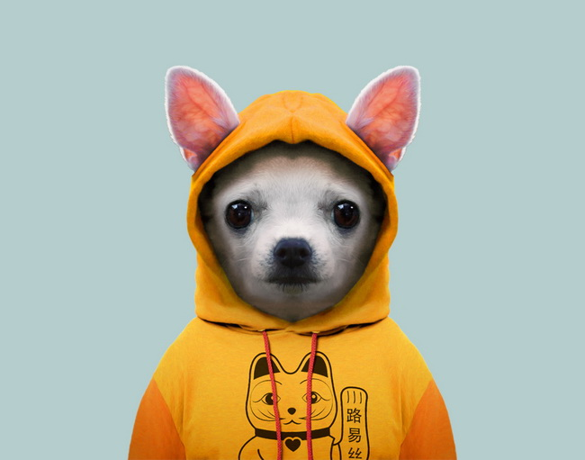
  * 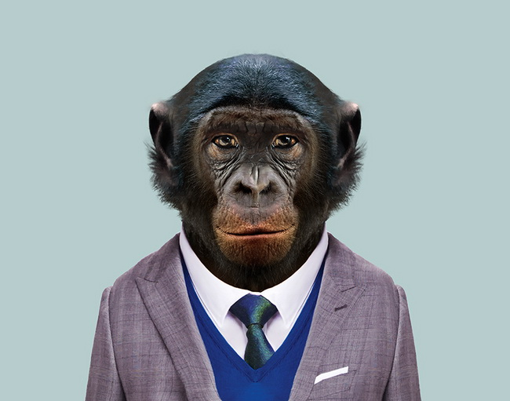
  * 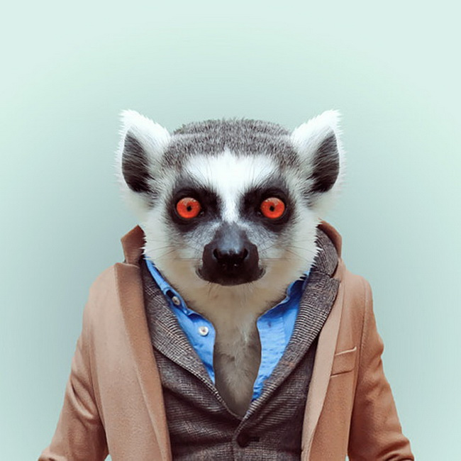
  * 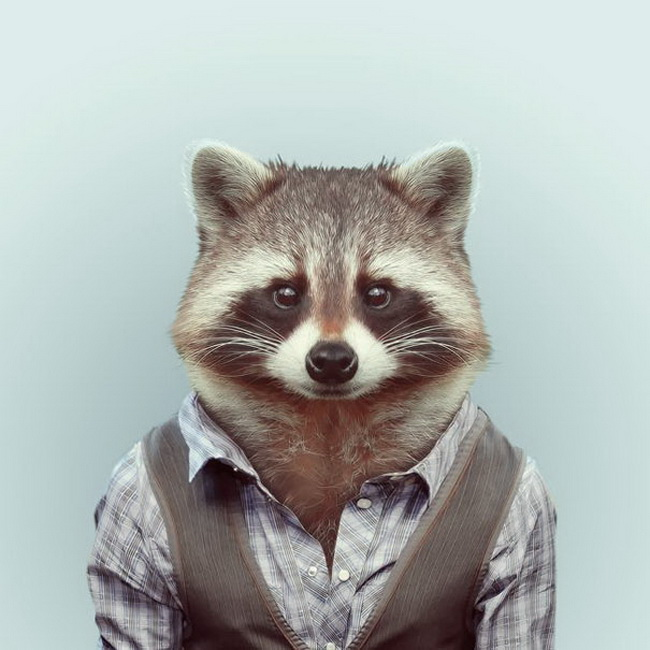
  * 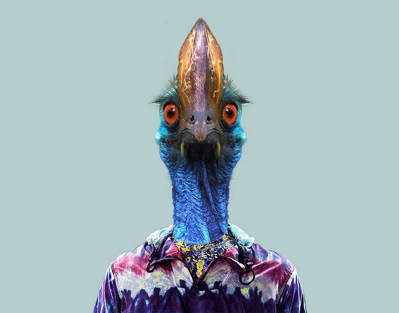
  * 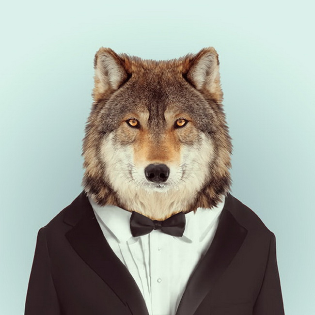
  * 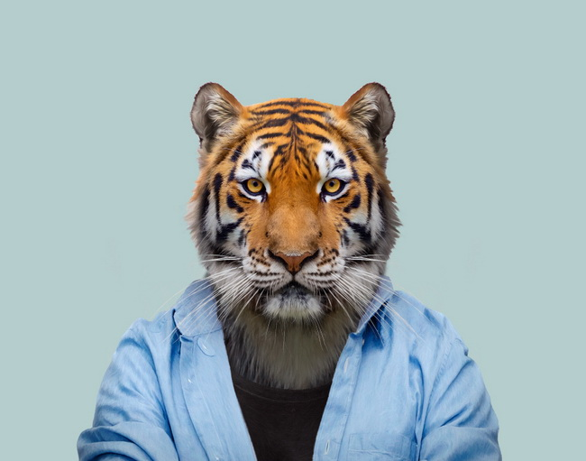
  * 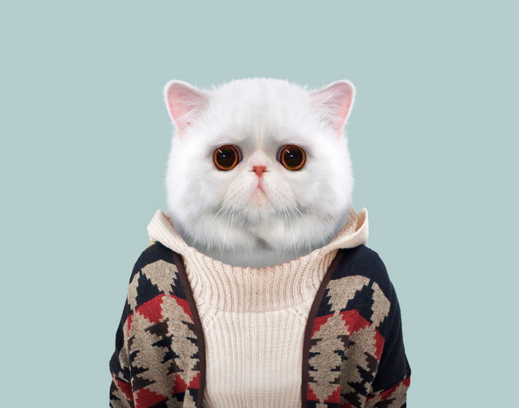
  * 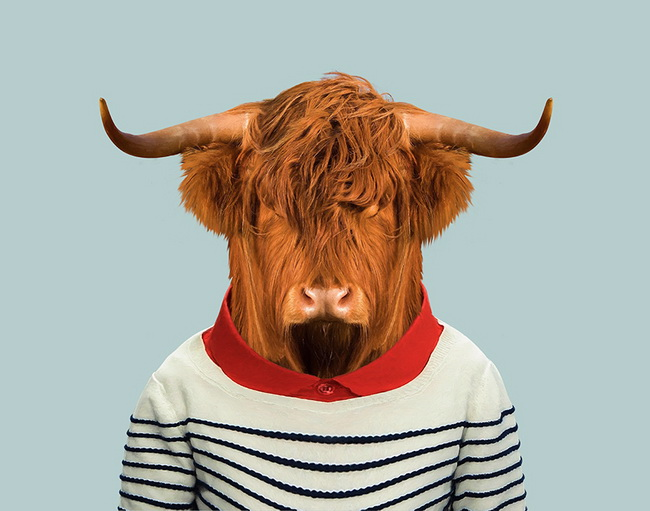
  * 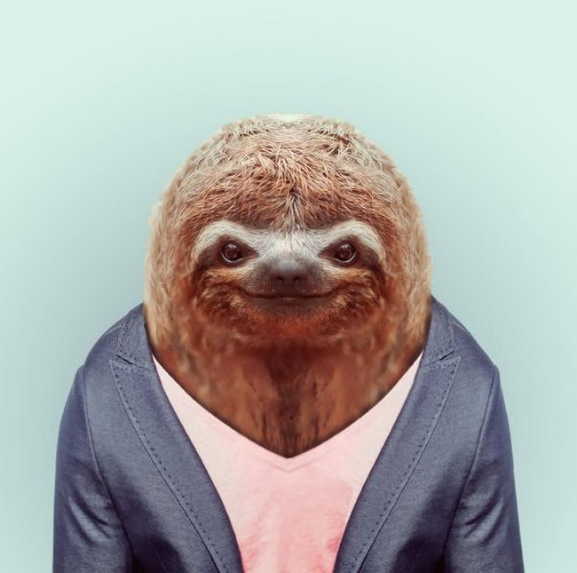
  * 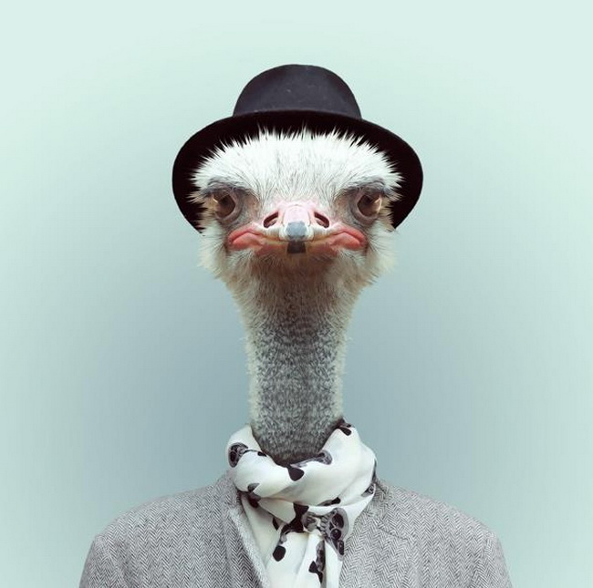
  * 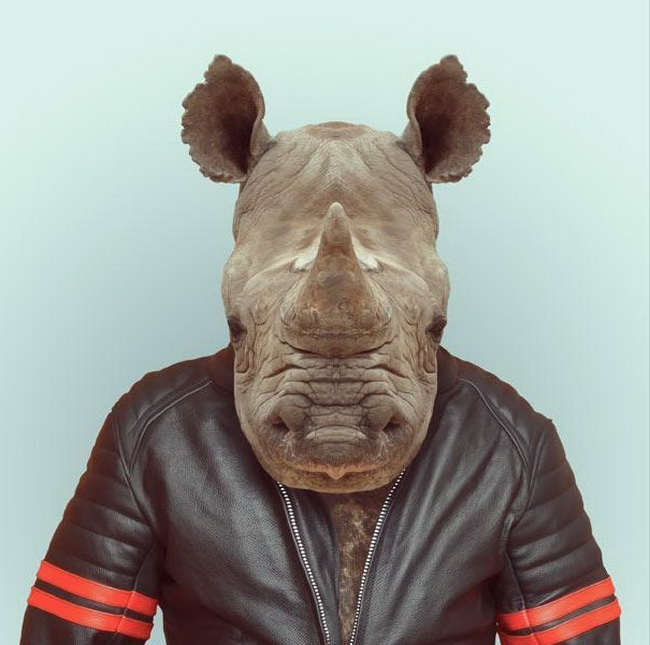
  * 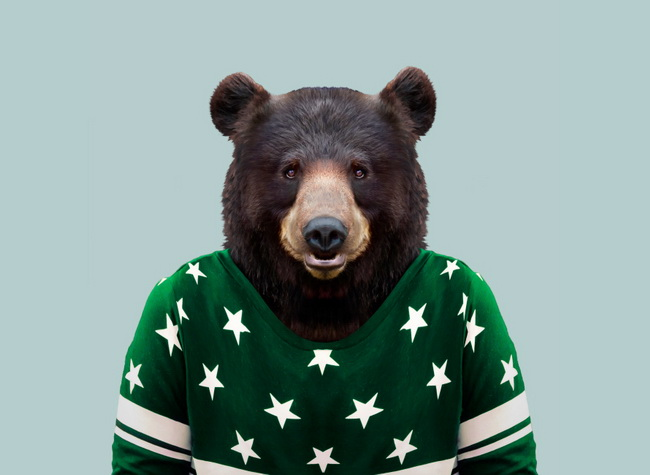
  * 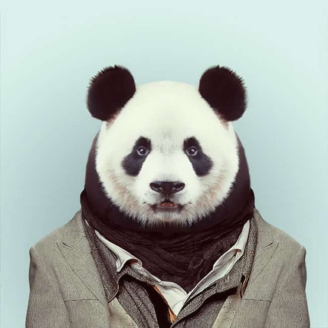
  * 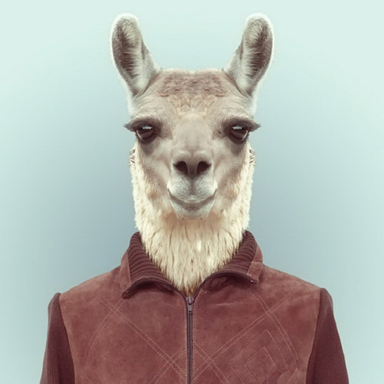
  * 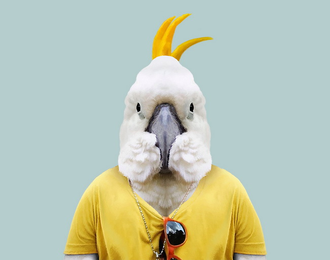
  * 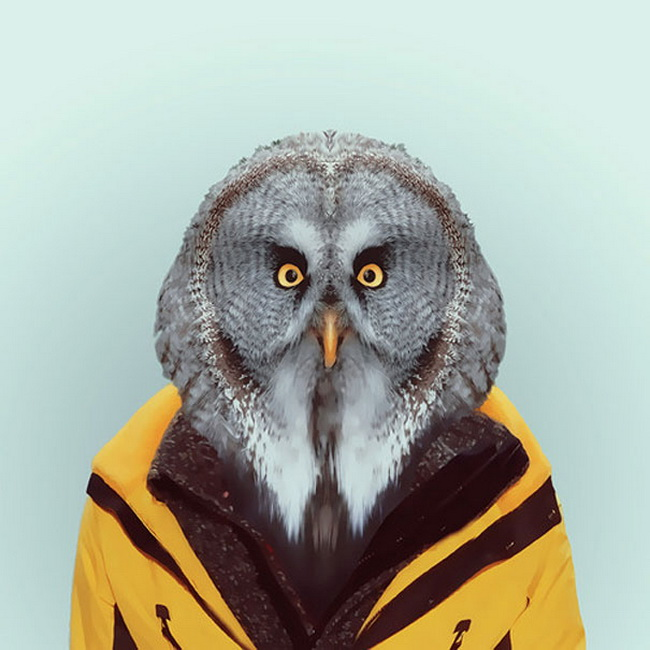
  * 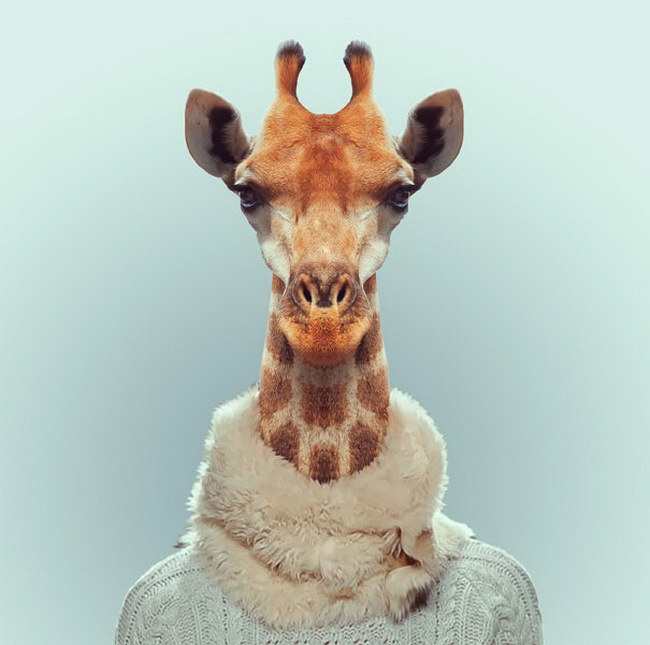
  * 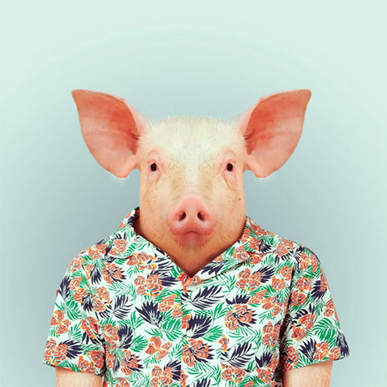
  * 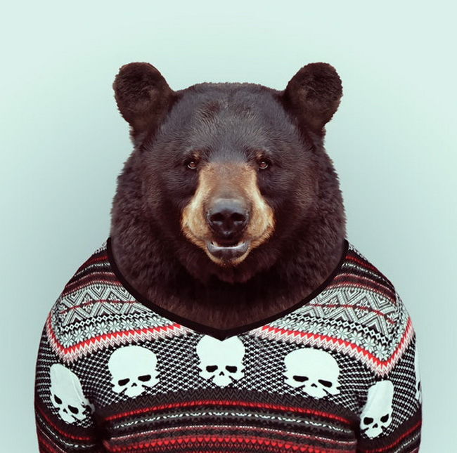

 
